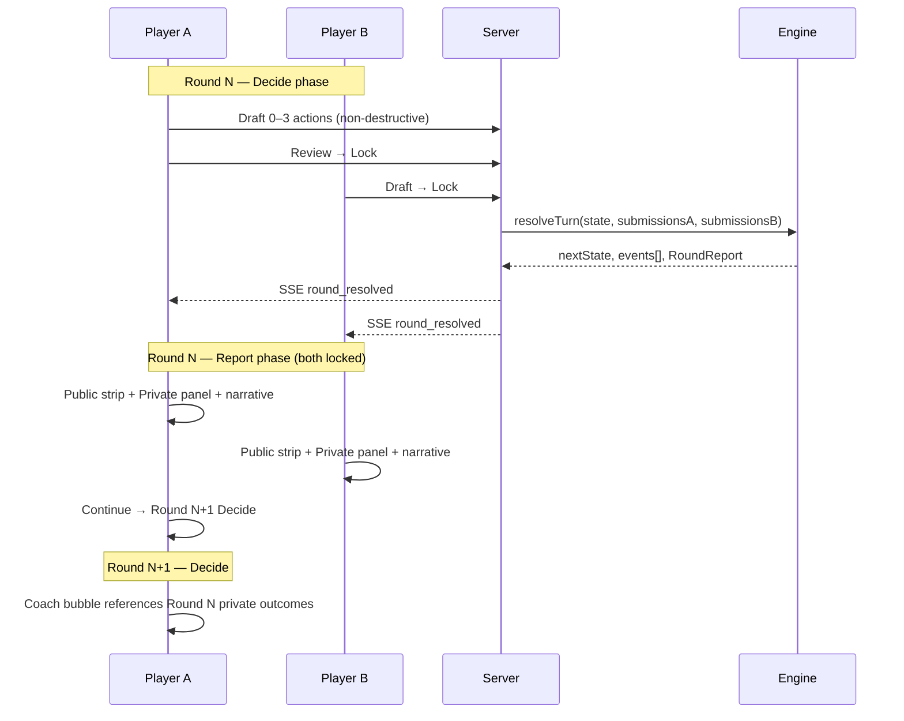

# The Price War — Game Specification (Source of Truth)

> **Status:** Locked for v1 Coffee Shop implementation (2026-05-25)  
> **Authority:** This document + [`apps/econblog/price-war reference files/price_war_engine_spec (1).xlsx`](apps/econblog/price-war%20reference%20files/price_war_engine_spec%20(1).xlsx)  
> **Overrides:** Wireframe JSX move names/IDs, current `packages/pricewar-engine/src/moves/catalog.ts`  
> **Infrastructure:** [`PRICE_WAR_EXECUTION_PLAN.md`](PRICE_WAR_EXECUTION_PLAN.md) §5–§6 (engine boundary, server, DB) still governs repo topology  

Product owner locked the following on 2026-05-25:

| Decision | Choice |
|----------|--------|
| Action catalog | **Full spreadsheet catalog (46 actions)** — nothing deferred to v1.1 |
| Action IDs | **Drop all current code move IDs** (`sales.set_price`, `marketing.influencer`, etc.) |
| Report timing | **After both players lock** — round resolves → report screen → next decide |
| Coach | **Prof. Aldo** on decide (and post-match); references last private report |
| Card UX | Collapsed card + **tooltip** (mechanic / strong when / risky when) |
| Simulation | Spreadsheet entity attributes, relationships, events, Coffee Shop config |

---

## 1. Document hierarchy

```
price_war_engine_spec (1).xlsx     ← domain model, formulas, full action/event tables
PRICE_WAR_GAME_SPEC.md             ← behavior contract for engineers (this file)
PRICE_WAR_ENGINE_EXECUTION.md      ← step-by-step engine → UI wiring (execute without re-asking)
PRICE_WAR_EXECUTION_PLAN.md        ← repo layout, API routes, infra, test gates
Wireframes (price-war reference files/) ← visual layout only; labels follow this spec
```

If wireframe copy conflicts with spreadsheet mechanics, **spreadsheet wins**.  
If this spec conflicts with the current engine code, **this spec wins**.

---

## 2. Round flow (player experience)



**Rules:**

1. Drafting is reversible until **Review & Lock**.
2. Resolution runs only when **both** slots have locked for the round.
3. Phase after resolve: **`report`** until the player taps Continue (then `decide` for next round, or `completed`).
4. Private outcomes from moves locked in round N appear in **round N's private report**, not on the decide screen in the same round.
5. Public opponent actions and market events appear in the **public** section of the same report.

---

## 3. Information disclosure

### 3.1 At Review & Lock (private forecast)

Before confirming, show a **forecast block** built from the Actions Catalog (deterministic parts only):

- **This round (immediate):** costs, public signals, capacity/mode changes  
- **Next report (delayed):** what you'll learn about morale, satisfaction, quality, etc.  
- **Risks:** stochastic or conditional downsides (worded as risk, not certainty)

Example (O08 + S01 + H05):

```
This round (immediate)
  • Overtime: +30% capacity; wage cost +50%; morale −0.08
  • Price → $4.00 — Riley sees this when you lock
  • Training budget $60/round — private spend

Next report (private)
  • Service quality and customer satisfaction update from workload
  • Skill inching up if training sustained

Risks
  • Cannot run overtime again if morale falls below 0.3
  • Training payoff is gradual (3–4 rounds)
```

### 3.2 Round report — Public (both players)

- Both players' **visible** stats: price, customer count, review score  
- **Public actions** taken this round (flash sale, loyalty launch, price-match announcement, etc.)  
- **Market / stochastic events** with named pills + short explanation  
- One-line public commentary (template): *"Riley dropped to $3.95. Heavy rain cut foot traffic."*

### 3.3 Round report — Private (you only)

- Full P&L (revenue, wages, inputs, marketing, net)  
- **Action outcomes** from your locked moves (morale, workload, satisfaction, stockouts, quits, skill)  
- Segment hints (regulars / casuals / new) where inferable  
- **Narrative paragraph** synthesizing private outcomes (template from engine facts)

### 3.4 Next Decide — Coach (Prof. Aldo)

One bubble tying **last private report** → **this round's decision**. Not generic tips.

> *"Last round you ran overtime — satisfaction slipped. Fix service or cut hours before Riley's price cut lands."*

Post-match: existing coach pipeline (facts → template or LLM), unchanged in scope.

### 3.5 Scout (F07)

Updates `Player.opponent_intel` with `{ attribute, value, confidence, roundObserved }`. Confidence decays ~20% per round. See spreadsheet Entity Attributes row for `opponent_intel`.

---

## 4. Action ID scheme

All actions use **spreadsheet codes** namespaced by domain:

| Domain | Prefix | Examples |
|--------|--------|----------|
| Sales | `sales.` | `sales.s01`, `sales.s05`, `sales.s08` |
| Procurement | `procurement.` | `procurement.p05`, `procurement.p07` |
| Operations | `operations.` | `operations.o07`, `operations.o08` |
| HR | `hr.` | `hr.h07`, `hr.h09` |
| Marketing | `marketing.` | `marketing.m07` |
| Finance | `finance.` | `finance.f07` |

**Migration:** Remove every ID in the old catalog (`sales.set_price`, `operations.extend_hours`, …).  
`operations.extend_hours` is **not** a separate move — use **`operations.o08`** (Activate overtime).

Catalog entry shape (engine + UI):

```ts
interface ActionDefinition {
  id: ActionId;                    // e.g. "sales.s04"
  spreadsheetCode: string;         // "S04"
  domain: Domain;
  name: string;                    // display
  tagline: string;                 // one line on card
  mechanic: string;                // tooltip: what engine does
  strongWhen: string;              // tooltip: context-dependent upside
  riskyWhen: string;               // tooltip: delayed/stochastic downside
  actionType: ActionType;          // from spreadsheet column
  visibility: "public" | "private";
  input: ActionInputSpec;
  immediateEffect: string;         // for lock forecast
  delayedEffect: string;
  duration: string;
  prerequisite?: string;
  cooldown?: string;
  stochasticNote?: string;
  entitiesModified: string[];      // spreadsheet column
  lessonSlug?: string;
}
```

---

## 5. Move budget and mode actions

- **Max 3 actions locked per player per round.**
- **Deployment mode** (`operations.o01`–`operations.o03`, `operations.o04`): at most **one** deployment change counts toward the 3 if the mode actually changes. Current mode persists if not selected.
- **Cash reserve** (`finance.f03` / `finance.f04`): mode switches follow same rule.
- **Premium positioning** (`sales.s06`), **local sourcing** (`procurement.p07`): persistent modes — changing them counts as 1 action.
- Actions with **prerequisites** render locked on the decide screen with reason from spreadsheet.
- Actions on **cooldown** render disabled with rounds remaining.

---

## 6. Entity model (Coffee Shop — Downtown)

v1 implements the **Coffee Shop (Downtown)** column from Scenario Configs. Other scenarios (Tech, Farm, Developing Nation) are out of scope until entity pipeline is proven.

### 6.1 Match parameters

| Parameter | Value |
|-----------|-------|
| Objective | `max_profit` |
| Win condition | Highest cumulative profit after **8 rounds** (bankruptcy rules still apply) |
| Starting cash | **$5,000** (10× spreadsheet base; see §6.4) |
| Starting staff | 3 |
| Starting wage | $15/worker/round |
| Starting morale | 0.7 |
| Starting skill | 0.4 |
| Base foot traffic | 100 customers/round |
| Tax rate | 0.15 |
| Interest rate | 0.05/round |
| Inflation | 0.01/round |
| Segment mix | 10% regulars, 60% casuals, 30% new |
| Base price sensitivity | 0.6 |
| Base demand elasticity | 1.2 |

Full attribute definitions, formulas, and visibility: **Entity Attributes** sheet in xlsx.

### 6.4 Money

Engine uses spreadsheet dollar amounts as-is (**$500** starting cash, $15 wages, etc.). No runtime scaling layer.

### 6.2 Entity groups (engine state)

| Group | Role |
|-------|------|
| **Environment** | Foot traffic, season, weather, active events, modifiers, benchmarks |
| **Product** | Price, supplier, quality, menu, equipment, inventory buffer, brand |
| **People** | Staff, wages, morale, skill, capacity, deployment mode, training |
| **Customers** | Traffic split, segments, satisfaction, loyalty, reviews, elasticity |
| **Player** | Cash, debt, marketing spend, reputation, intel, action history |

Relationships between attributes: **Relationships** sheet (causal matrix). The engine must implement edges needed for Coffee Shop v1, not a single 50/50 split.

### 6.3 Core allocation formula

From spreadsheet `Customers.segment_allocation_formula`:

```
your_share = base_share
  × price_attractiveness
  × reputation_factor
  × loyalty_anchor
  × capacity_available

price_attractiveness = 1 + elasticity × (opponent_price - your_price) / avg_price
reputation_factor    = 1 + 0.2 × (your_reputation - opponent_reputation)
loyalty_anchor       = segment_regulars (sticky up to threshold)

your_customers = round(available_traffic × normalized(your_share))
capped by People.total_capacity
```

Revenue: `units_sold × revenue_per_customer` (with menu/bundle logic per actions).  
Expenses: inputs, wages, maintenance, marketing, training, interest, rent, one-shots.

---

## 7. Resolution pipeline

Fixed order (from execution plan §5). Each step is a **pure function** appending to `EngineEvent[]`:

```
1. validate(submissions, state, scenario)
2. applyPolicies(state)           // loyalty program ongoing, price-match commitment, etc.
3. applyEvents(state, rng)       // stochastic events + durations
4. applyActions(state, A, B)     // resolve locked actions via handler registry
5. product(state)
6. people(state)
7. demand(state, rng)
8. allocate(state)
9. finance(state)
10. reputation(state)
11. triggers(state)               // bankruptcy, match end
12. buildReports(state, events)   // public + private + fact bundle for narrative
```

**Determinism:** RNG seed = `matchId:round` (mulberry32). Same inputs → same outputs.

**Visibility:** Engine outputs canonical `MatchState` only. Server calls `toPlayerView(state, slot)`.

---

## 8. Full action catalog (46 actions)

All actions ship in v1. Handler + catalog entry + tooltip copy required for each.

### Sales

| ID | Name | Type | Visibility |
|----|------|------|------------|
| `sales.s01` | Set price | Continuous (slider) | Public |
| `sales.s02` | Expand menu | Discrete | Public |
| `sales.s03` | Simplify menu | Discrete | Public |
| `sales.s04` | Flash sale | One-shot | Public |
| `sales.s05` | Price match guarantee | Commitment | Public |
| `sales.s06` | Premium positioning | Mode switch | Public |
| `sales.s07` | Bundle offer | Temporary (3 rounds) | Public |
| `sales.s08` | Surge pricing | Conditional trigger | Public |

### Procurement

| ID | Name | Type | Visibility |
|----|------|------|------------|
| `procurement.p01` | Upgrade supplier tier | Discrete | Private |
| `procurement.p02` | Downgrade supplier tier | Discrete | Private |
| `procurement.p03` | Increase inventory buffer | Discrete | Private |
| `procurement.p04` | Reduce inventory buffer | Discrete | Private |
| `procurement.p05` | Exclusive supplier deal | One-shot (once/match) | Private |
| `procurement.p06` | Negotiate bulk discount | Temporary (4 rounds) | Private |
| `procurement.p07` | Source locally | Mode switch | Private |

### Operations

| ID | Name | Type | Visibility |
|----|------|------|------------|
| `operations.o01` | Deployment: speed mode | Mode switch | Private |
| `operations.o02` | Deployment: quality mode | Mode switch | Private |
| `operations.o03` | Deployment: balanced mode | Mode switch | Private |
| `operations.o04` | Deployment: customer focus | Mode switch | Private |
| `operations.o05` | Upgrade equipment | One-shot | Private |
| `operations.o06` | Perform maintenance | One-shot | Private |
| `operations.o07` | Start R&D project | Multi-round | Private |
| `operations.o08` | Activate overtime | One-shot (1 round) | Private |

### HR

| ID | Name | Type | Visibility |
|----|------|------|------------|
| `hr.h01` | Hire worker | Discrete | Private |
| `hr.h02` | Fire worker | Discrete | Private |
| `hr.h03` | Raise wages | Continuous | Private |
| `hr.h04` | Cut wages | Continuous | Private |
| `hr.h05` | Invest in training | Continuous | Private |
| `hr.h06` | Stop training | Discrete | Private |
| `hr.h07` | Poach competitor's staff | One-shot | Private |
| `hr.h08` | Restructure team | One-shot | Private |
| `hr.h09` | Performance bonus | One-shot | Private |

### Marketing

| ID | Name | Type | Visibility |
|----|------|------|------------|
| `marketing.m01` | Set marketing budget | Continuous | Private |
| `marketing.m02` | Launch loyalty program | One-shot | Public |
| `marketing.m03` | Deactivate loyalty program | One-shot | Public |
| `marketing.m04` | Run targeted campaign | One-shot (2 rounds) | Private |
| `marketing.m05` | Counter-marketing | One-shot reactive | Private |
| `marketing.m06` | Sponsor local event | One-shot | Public |
| `marketing.m07` | Rebrand | One-shot (once/match) | Public |

### Finance

| ID | Name | Type | Visibility |
|----|------|------|------------|
| `finance.f01` | Take loan | Discrete | Private |
| `finance.f02` | Repay debt | Discrete | Private |
| `finance.f03` | Cash reserve mode | Mode switch | Private |
| `finance.f04` | Exit cash reserve mode | Mode switch | Private |
| `finance.f05` | Insurance purchase | Ongoing | Private |
| `finance.f06` | Declare dividend | One-shot | Private |
| `finance.f07` | Scout opponent | One-shot | Private |

Mechanics, costs, prerequisites, cooldowns, and attribute deltas: **Actions Catalog** sheet (columns Immediate Effect → Lesson Link). Implementations must match those columns unless this spec is amended.

---

## 9. Stochastic events (Coffee Shop)

Events drawn each round from location-weighted table (`Environment.event_probability_table`). Player sees **name + effect description**, not raw probabilities.

**High-frequency (downtown coffee):** Health inspection, bad weather, supply disruption, traffic events, utility spike, worker quits/sick, staff conflict, bulk catering order, competitor promotion.

**Medium:** Festival, viral reviews ±, social media trend, food safety scare, influencer visit, favorable press, employee of the month.

**Macro / persistent:** Recession, boom, regulatory change, minimum wage, landlord rent, union formation (via `union_risk`), competitor opens, technology breakthrough, supplier bankruptcy, transit stop.

**Catastrophic (coastal-only etc.):** Hurricane excluded for downtown coffee unless scenario config extended.

Each event row defines: duration, affected entities, attribute math, mitigation. See **Stochastic Events** sheet.

Engine emits `event_applied` entries in the trace for narrative and admin replay.

---

## 10. UI specification

### 10.1 Decide screen — collapsed card

- Domain color stripe, glyph, serif **name**, **tagline**
- Visibility pill: `PUBLIC` or `HIDDEN`
- Input control (slider / stepper / toggle / segmented mode / scout picker)
- Footer: domain tag · duration · **estimated cost** · `[ Draft move ]`
- Drafted: domain border glow + `✓ Drafted`

### 10.2 Tooltip (hover or tap “Details”)

Three blocks from catalog metadata:

1. **Mechanic** — plain English from Actions Catalog  
2. **Strong when** — evaluated against current `PlayerView` where possible (e.g. “foot traffic is high”, “capacity has headroom”)  
3. **Risky when** — delayed/stochastic downsides  

Wireframe reference: `pricewar-v2-library.jsx`, `pricewar-v2-decide.jsx`.

### 10.3 Draft sidebar (3 slots)

```
Sales · Set price → $4.00
        Public · Persistent
HR · Training $60/round
        Hidden · Effect builds over 2–3 rounds
```

### 10.4 Review & Lock

- List of 3 moves with inputs  
- **Forecast block** (§3.1)  
- `Back to edit` · **`Lock N moves →`**

### 10.5 Report screen (after both lock)

**Top — public strip:** vs opponent stats, event pills, public action chips, one-line market commentary.

**Middle — private panel:** P&L, action outcome bullets, narrative paragraph.

**Bottom:** Continue to Round N+1 · Back to lobby.

### 10.6 Coach

- **Decide:** `CoachBubble` — Prof. Aldo, callback to prior private report + opponent public state  
- **Post-match:** existing debrief flow  

---

## 11. Narrative generation

**Stage 1 (engine, every round):** `buildRoundFacts(events, state, slot)` → structured facts:

- publicActions[], marketEvents[], demandSplit, cashDelta, outcomeBullets[] (morale, satisfaction, quits, …)

**Stage 2 (engine template):** `renderRoundNarrative(facts, slot)` → 2–4 sentences for private report. No LLM required for mid-match.

**Stage 3 (post-match, optional LLM):** unchanged — `extractFacts` + coach for paid users.

Templates must only assert facts present in the event trace (no hallucinated opponent private state).

---

## 12. Engine implementation notes (performance)

The full entity model is large. Before writing handlers for all 46 actions, agree on these constraints:

1. **Pipeline steps are separate modules** — no monolithic `resolve-turn.ts` if/else chain.  
2. **One handler per action** — registry map `ActionId → handler`; adding S09 does not touch O08.  
3. **Single state clone per step**, not per move.  
4. **Attribute updates batched** — compute derived fields (`total_capacity`, `effective_input_cost`) once per step.  
5. **Event log append-only** — narrative reads trace post-resolve; no string building inside hot handlers.  
6. **Golden fixtures** — 10–20 representative rounds replayed in CI; determinism gate on every pipeline change.  
7. **Profile before optimizing** — expected cost is microseconds–milliseconds per resolve; bottleneck will be DB + SSE, not arithmetic, if pipeline stays pure.

A dedicated **engine performance / structure** review happens after this spec is accepted and before bulk handler implementation.

---

## 13. Deprecations

| Remove | Replace with |
|--------|----------------|
| All 25 IDs in current `moves/catalog.ts` | Spreadsheet IDs in §8 |
| `operations.extend_hours` | `operations.o08` |
| 50/50 demand split in `resolve-turn.ts` | §6.3 allocation |
| Decorative `WeatherChip` without data | Event pills from `RoundReport.publicEvents` |
| `$500` spreadsheet costs in engine | Raw values in `simulation/config.ts` |
| Manual “Play bot” only queue fallback | Keep; unrelated to catalog |

---

## 14. Acceptance criteria (game feel)

- [ ] All **46 actions** appear in decide UI with tooltips (mechanic / strong / risky).  
- [ ] Lock forecast shows immediate + delayed + risks for selected moves.  
- [ ] Report renders **after both lock** with distinct public and private sections.  
- [ ] Private outcomes from round N visible in round N report; demand impact may lag per spreadsheet.  
- [ ] Prof. Aldo references last private report on decide.  
- [ ] Stochastic events appear as named pills with descriptions.  
- [ ] Demand responds to price, reputation, capacity, segments — not 50/50.  
- [ ] Replay of stored submissions reproduces identical state (determinism test).  

---

## 15. Next steps (no code until spec review)

1. **Product review** this document + spot-check xlsx rows for S05, H07, P05, O07, M07.  
2. **Engine structure session** — module layout, handler registry, fact/n narrative builders, perf boundaries.  
3. Implement types + catalog (46 entries) + pipeline stubs with tests.  
4. Implement entity groups incrementally (Environment → Product → People → Customers → finance).  
5. Wire UI to new catalog metadata and report/coach flows.  

---

*Spreadsheet path:* `apps/econblog/price-war reference files/price_war_engine_spec (1).xlsx`  
*Sheets:* Entity Attributes · Relationships · Stochastic Events · Scenario Configs · Actions Catalog
