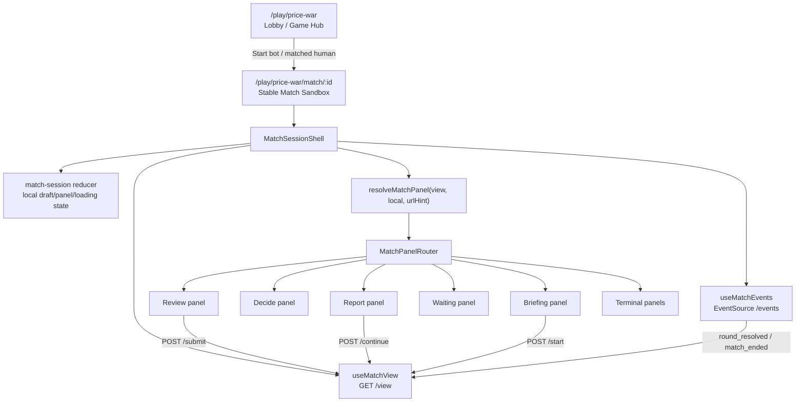

# Price War Game Shell Architecture Report

Date: 2026-05-26

## Executive Summary

Price War currently behaves more like a multi-page web app than a sandboxed web game session. The backend match model is sound: the server owns match state, the client fetches a `PlayerView`, and SSE events push important match changes. The major UX weakness is on the client architecture: each match phase is encoded as a separate Next.js route (`/briefing`, `/decide`, `/review`, `/waiting`, `/report/[round]`, `/postmatch`, etc.), and navigation between phases is mostly implemented as `router.push()` / `router.replace()` calls.

That means the browser URL is acting as the game state machine. Each phase transition can remount pages, re-run loading gates, re-resolve route state, and briefly show sync screens. That is the opposite of the "game tab" model used by many browser games, where a match creates one stable session surface and all internal game states render inside it.

The target architecture should be:

```text
/play/price-war                 Lobby / game hub
/play/price-war/match/[id]       One stable match sandbox

Inside the match sandbox:
  MatchSessionProvider
  MatchConnectionProvider
  MatchPanelRouter
  briefing | decide | review | waiting | report | terminal panels
```

The URL should identify the match, not drive every moment of the match. The active screen should be resolved inside a long-lived match shell from server state plus local UI state. Old phase URLs can remain as compatibility redirects or thin aliases, but they should stop being the primary runtime architecture.

## What "Sandboxed Web Game" Means Here

The word "sandbox" can mean several things. For this project, the useful meaning is not security isolation. It is session isolation:

- A started match gets one durable client-side workspace.
- The match workspace remains mounted while rounds advance.
- Game state changes update panels inside that workspace.
- Local draft/review/waiting state survives normal game transitions.
- The player does not feel the app refreshing, rerouting, or reconstructing the game after every action.
- The server remains authoritative, so refresh/reconnect can rebuild the session from a canonical snapshot.

Pokemon Showdown is a useful mental model because each battle is presented as a stable room/tab. You can move around the app, but the battle itself feels like one contained object with its own log, controls, state, and connection lifecycle.

For Price War, the equivalent should be a "match room" or "match tab" inside the UI. The player starts or resumes a match, then everything about that match happens inside one persistent shell.

## Current Architecture

### Route Layout

The route constants live in `apps/econblog/src/lib/games/routes.ts`:

```ts
export const priceWarPaths = {
  lobby: PRICE_WAR,
  history: `${PRICE_WAR}/history`,
  scenario: `${PRICE_WAR}/scenario`,
  leaderboard: `${PRICE_WAR}/leaderboard`,
  notifications: `${PRICE_WAR}/notifications`,
  tutorial: `${PRICE_WAR}/tutorial`,
  queue: (mode?: string) =>
    mode ? `${PRICE_WAR}/queue?mode=${encodeURIComponent(mode)}` : `${PRICE_WAR}/queue`,
  match: {
    briefing: (matchId: string) => `${PRICE_WAR}/match/${matchId}/briefing`,
    decide: (matchId: string) => `${PRICE_WAR}/match/${matchId}/decide`,
    review: (matchId: string) => `${PRICE_WAR}/match/${matchId}/review`,
    waiting: (matchId: string) => `${PRICE_WAR}/match/${matchId}/waiting`,
    postmatch: (matchId: string) => `${PRICE_WAR}/match/${matchId}/postmatch`,
    bankruptcy: (matchId: string) => `${PRICE_WAR}/match/${matchId}/bankruptcy`,
    abandoned: (matchId: string) => `${PRICE_WAR}/match/${matchId}/abandoned`,
    report: (matchId: string, round: number | string) =>
      `${PRICE_WAR}/match/${matchId}/report/${round}`,
  },
} as const;
```

Current match pages:

| Current URL | Role |
| --- | --- |
| `/play/price-war/match/[id]/briefing` | Pre-round briefing and start button |
| `/play/price-war/match/[id]/decide` | Move selection, or waiting-for-opponent lobby |
| `/play/price-war/match/[id]/review` | Review selected moves before lock-in |
| `/play/price-war/match/[id]/waiting` | Locked-in waiting screen |
| `/play/price-war/match/[id]/report/[round]` | Round report |
| `/play/price-war/match/[id]/postmatch` | Normal terminal screen |
| `/play/price-war/match/[id]/bankruptcy` | Bankruptcy terminal screen |
| `/play/price-war/match/[id]/abandoned` | Abandonment terminal screen |

The top-level game layout in `apps/econblog/src/app/(game)/layout.tsx` wraps all game pages with `GameShell` and `GameErrorBoundary`. `GameShell` in `apps/econblog/src/components/pricewar/shell/GameShell.tsx` provides React Query, the Price War error modal provider, and Cafe Duel styling. It is useful app chrome, but it is not a match sandbox. It does not own a match session or keep all match phases mounted under one client state machine.

### Match Live Provider

The match route group is wrapped by `apps/econblog/src/app/(game)/play/price-war/match/[id]/layout.tsx`:

```tsx
import { MatchLiveProvider } from "@/components/pricewar/shell/MatchLiveProvider";

export default function MatchLayout({ children }: { children: React.ReactNode }) {
  return <MatchLiveProvider>{children}</MatchLiveProvider>;
}
```

`MatchLiveProvider` is the closest thing to a game runtime today. It:

- Loads the current `PlayerView` with `useMatchView(matchId)`.
- Subscribes to match SSE with `useMatchEvents(matchId, ...)`.
- Redirects when the current path does not match the server phase.
- Shows sync and disconnected-opponent overlays.
- Routes `round_resolved` events to `/report/[round]`.
- Routes `match_ended` events to `/postmatch`, `/bankruptcy`, or `/abandoned`.

The key issue is that `MatchLiveProvider` still uses route replacement as its primary phase transition mechanism:

```tsx
if (!shouldRedirectToPhasePath(pathname, view)) {
  setPhaseSyncing(false);
  return;
}
setPhaseSyncing(true);
router.replace(getMatchPhasePath(matchId, view));
```

That means the provider coordinates pages, but it does not replace pages with an internal game shell.

### Server Phase to URL Mapping

`apps/econblog/src/client/pricewar/match-routing.ts` maps server phases to pages:

| Server phase | Current canonical URL |
| --- | --- |
| `waiting_for_opponent` | `/match/[id]/decide` |
| `briefing` | `/match/[id]/briefing` |
| `decide` | `/match/[id]/decide` |
| `resolving` | `/match/[id]/decide` |
| `report` | `/match/[id]/report/[lastResolvedRound]` |
| `completed` | terminal page chosen by outcome |

There are already special cases to prevent destructive redirects during stale-state windows:

- Do not redirect away from `/report/[round]` if the view briefly says `decide` after lock-in.
- Do not redirect from `/decide` back to `/briefing` while the briefing view is stale after start.
- Do not pull users off terminal screens while fresh completed state is loading.
- Treat `/review`, `/waiting`, and `/briefing` as "decide sub-routes" in some situations.

Those tests in `apps/econblog/test/client/match-routing.test.ts` are important evidence. They show the current architecture is already compensating for URL-driven phase races.

### Data Loading

The primary match view hook is `apps/econblog/src/client/pricewar/hooks/useMatchView.ts`:

```ts
export function useMatchView(matchId: string) {
  return useQuery({
    queryKey: matchViewQueryKey(matchId),
    queryFn: async (): Promise<PlayerView> => {
      const res = await fetch(`/api/pricewar/match/${matchId}/view`);
      if (!res.ok) throw new Error("Failed to load match");
      return res.json();
    },
    refetchInterval: (query) => matchViewPollMs(query.state.data),
    refetchOnWindowFocus: true,
  });
}
```

This part is generally healthy. It uses React Query as a shared client cache and adjusts polling frequency by phase. The server endpoint `apps/econblog/src/app/api/pricewar/match/[id]/view/route.ts` returns the authoritative player-specific snapshot.

Secondary state is loaded separately:

| Data | Current location |
| --- | --- |
| Round report | `GET /api/pricewar/match/[id]/report/[round]` from report page |
| Legal moves | `useLegalMoves` |
| Forecast | `useLockForecast` |
| Match summary | postmatch/summary hooks |
| Coach report | postmatch coach query |
| Lobby presence | `GET /api/pricewar/lobby/status` |
| Matchmaking status | `GET /api/pricewar/matchmaking/status` |

This can be reused in the target architecture. The issue is not the existence of queries; it is that query ownership is spread across phase pages instead of being coordinated by a persistent match session.

### Realtime Updates

The project already has SSE support:

- Client hook: `apps/econblog/src/client/pricewar/hooks/useMatchEvents.ts`
- Server route: `apps/econblog/src/app/api/pricewar/match/[id]/events/route.ts`
- Pub/sub helper: `apps/econblog/src/server/pricewar/sse.ts`

The server route returns `Content-Type: text/event-stream`, sends heartbeat comments, syncs clocks/lifecycle on heartbeat, and marks a player disconnected on abort.

This is a strong fit for a turn-based strategy game. Server-Sent Events are one-way from server to browser, which is enough for notifications like opponent locked, round resolved, match started, match ended, clock warning, and opponent disconnected. Player commands can stay as HTTP POSTs. WebSockets become more attractive if the game needs frequent bidirectional realtime input, chat, cursor-like interactions, or very low-latency action streams.

One operational caveat from MDN: SSE over HTTP/1.x has a low per-browser/per-domain connection limit, often six. If Price War introduces multiple active in-app match tabs at once, the client should avoid opening one EventSource per inactive tab. Keep only the visible/active match connected, or multiplex events through one stream.

### Local Client State

`apps/econblog/src/client/pricewar/match-session-storage.ts` stores local per-match data:

- Draft moves
- Locked moves
- Briefing seen flag
- Last private report line
- Cash trend

This is currently necessary because the app navigates between pages. For example:

1. `/decide` saves a draft into `sessionStorage`.
2. `/review` loads the draft from `sessionStorage`.
3. `/review` saves locked moves into `sessionStorage`.
4. `/waiting` loads locked moves from `sessionStorage`.

In a sandboxed game shell, this should become in-memory match session state first, with `sessionStorage` only as a refresh/recovery backup.

## Why the Current UX Feels Non-Game-Like

The flaw is not that there are multiple screens. Games often have many internal screens. The flaw is that the app uses URL navigation as the mechanism for internal game phase changes.

That produces several UX problems:

- Phase transitions feel like page transitions instead of game transitions.
- Loading overlays appear because a new page is mounting and reloading its slice of state.
- Client-only state has to be serialized through `sessionStorage`.
- Redirect rules become complicated because server state, route state, and user-intended sub-state can temporarily disagree.
- The game cannot easily support a persistent battle log, side rail, opponent status, reconnect banner, or match tab header across all phases.
- Multiple concurrent matches would be hard because the runtime is tied to the current route rather than a session object.
- The browser history stack receives internal game states that are not always useful history entries.

React's state model explains part of the issue: React preserves state while the same component remains at the same position in the render tree. When phase changes replace route pages, the game relies on cache/session storage instead of a stable component tree to preserve the player's ongoing session.

## Current UI State Sketches

This section is a baseline sketch of the current Price War UI before any redesign. It is intentionally descriptive, not prescriptive. The goal is to make sure the current product shape is understood before changing the UI plan.

### 1. Lobby: Idle Game Hub

Route: `/play/price-war`

Main components: `LobbyScreen`, `LobbyHeader`, `LobbyArenaHero`, `LobbyModeCard`, `LobbyBattleRow`, `LobbyCoachCard`

```text
┌────────────────────────────────────────────────────────────────────┐
│ Lobby header                                                       │
│ username · rating/unrated · online-now indicator                   │
├────────────────────────────────────┬───────────────────────────────┤
│ Hero / arena card                   │ Live lobby card               │
│ "Welcome back"                      │ Online / Blitz queue / wait   │
│ "Ready for another round?"          │ Active match row if present   │
│                                     │ Recent battle rows            │
│ [Find Match] [Play CPU]             │ [View all matches]            │
│                                     │                               │
│ Stats: wins / losses / streak /     │ Coach card                    │
│ rating                              │ insight + optional review CTA │
├────────────────────────────────────┴───────────────────────────────┤
│ Play modes grid                                                     │
│ Blitz card · Rapid card if paid/unpaid locked · Tutorial card       │
└────────────────────────────────────────────────────────────────────┘
```

Current behavior:

- `Find Match` starts inline matchmaking from the lobby.
- `Play CPU` starts a bot match.
- Tutorial mode selection routes to `/tutorial`, which auto-starts a tutorial bot match.
- Rapid appears locked for unpaid users and shows a subscribe prompt.
- Active/recent matches are shown in the right rail.

### 2. Lobby: Inline Searching

Route: `/play/price-war`

Same screen as idle lobby, but the hero CTA row changes.

```text
┌────────────────────────────────────────────────────────────────────┐
│ Lobby header                                                       │
├────────────────────────────────────┬───────────────────────────────┤
│ Hero / arena card                   │ Live lobby / recent matches   │
│ "Ready for another round?"          │                               │
│                                     │                               │
│ [Searching for opponent... 00:12]   │                               │
│ [Cancel]                            │                               │
├────────────────────────────────────┴───────────────────────────────┤
│ Play modes grid disabled while searching                            │
└────────────────────────────────────────────────────────────────────┘
```

Current behavior:

- The lobby polls matchmaking status every two seconds while searching.
- The elapsed timer increments locally.
- If matched, `enterMatch()` routes to the current phase URL.
- A separate full queue page also exists, so search UX is currently split between inline lobby search and `/queue`.

### 3. Scenario Selection

Route: `/play/price-war/scenario`

Main component: `ScenarioScreen`

```text
┌────────────────────────────────────────────────────────────────────┐
│ [← Lobby]                                                          │
│                                                                    │
│ CHOOSE YOUR BATTLEGROUND                                           │
│ Where are we trading punches today?                                │
│ Scenarios change domains, rounds, and opponent moves.              │
│                                                                    │
│ ┌──────────────┐ ┌──────────────┐ ┌──────────────┐ ┌────────────┐ │
│ │ Coffee Shop  │ │ Food Truck   │ │ Bookshop     │ │ SaaS       │ │
│ │ selected     │ │ locked       │ │ locked       │ │ locked     │ │
│ │ 8 rounds     │ │ 5 rounds     │ │ 10 rounds    │ │ 12 rounds  │ │
│ └──────────────┘ └──────────────┘ └──────────────┘ └────────────┘ │
│                                                                    │
│ [Queue Coffee Shop →] [Practice solo]                              │
└────────────────────────────────────────────────────────────────────┘
```

Current behavior:

- Only Coffee Shop is available.
- Other scenarios are visible but locked.
- Queue routes to the dedicated queue flow if no instant match is found.
- Practice starts a bot match and routes to the match phase.

### 4. Dedicated Queue Page

Route: `/play/price-war/queue?mode=...`

Main component: `QueueScreen`

```text
┌────────────────────────────────────────────────────────────────────┐
│ [← Cancel]                                                         │
│                                                                    │
│                         player avatar + pulse rings                │
│                                                                    │
│ SEARCHING FOR AN OPPONENT                                          │
│ Finding someone in your league... / Finding an opponent...         │
│ mode · Coffee Shop · unrated/rated context                         │
│                                                                    │
│ Your Elo       Searching range       In queue                      │
│ 1420           1270 to 1570          00:18                         │
│                                                                    │
│ [rated range widening bar]                                         │
│ AI opponent in 12s if no human is found.                           │
│                                                                    │
│ [Cancel search] [Play a bot now]                                   │
│                                                                    │
│ Prof. Aldo bubble: while-we-wait tip                               │
└────────────────────────────────────────────────────────────────────┘
```

Current variants:

- Rated users see Elo and search range.
- Unrated users do not see the Elo range.
- When bot fallback time reaches zero, copy changes to "Matching with AI opponent" and the bot button disappears.
- When matched, an overlay loading gate appears before routing into the match.

### 5. Tutorial Start

Route: `/play/price-war/tutorial`

Current UI is a transient setup screen, not the tutorial itself.

```text
┌────────────────────────────────────────────────────────────────────┐
│                                                                    │
│                    player avatar + pulse ring                      │
│                                                                    │
│ TUTORIAL                                                           │
│ Setting up your first match...                                     │
│ Guided practice. No clock, no rating impact.                       │
│                                                                    │
└────────────────────────────────────────────────────────────────────┘
```

Current behavior:

- The page auto-creates a tutorial bot match.
- It routes directly into the match decide flow.
- Tutorial skips the normal briefing page.

### 6. Match Lobby: Waiting For Opponent

Current route: `/play/price-war/match/[id]/decide` when server phase is `waiting_for_opponent`

Main component: `CafeMatchLobbyScreen`

```text
┌──────────────────────────────────────────────┐
│              player avatar + pulse           │
│ WAITING FOR OPPONENT                         │
│ Match lobby                                  │
│ Match starts when both players connect.      │
│ No-show after 60s/120s is a forfeit.         │
│                                              │
│        [You avatar]    vs    [Opponent]      │
│              opponent display name           │
└──────────────────────────────────────────────┘
```

Current behavior:

- This is rendered inside the decide page, not a separate visible match-room shell.
- It has a compact centered card and no persistent match tabs/log.

### 7. Briefing

Route: `/play/price-war/match/[id]/briefing`

Main component: `BriefingScreen`

```text
┌────────────────────────────────────────────────────────────────────┐
│ Coffee backdrop card                                               │
│                                                                    │
│ OPPONENT LOCATED · Coffee Shop · Downtown                          │
│ You've drawn {opponent first name}.                                │
│ 8 rounds. Ranked/practice copy. Optional vs CPU copy.              │
│                                                                    │
│          You avatar       vs       Opponent avatar                 │
│          You                       Opponent name                   │
│          Elo if rated              CPU opponent if bot             │
│                                                                    │
│ Bot playstyle hint, if bot                                         │
│                                                                    │
│ [Begin Round 1 →]                                                   │
└────────────────────────────────────────────────────────────────────┘
│ Prof. Aldo bubble: opening advice                                  │
└────────────────────────────────────────────────────────────────────┘
```

Current behavior:

- Human/bot match setup feels like a pre-game card.
- Tutorial immediately redirects away from this screen.
- Begin calls `POST /start`, refreshes view, then routes to `/decide`.

### 8. Decide: Choose Moves

Route: `/play/price-war/match/[id]/decide`

Main component: `DecideScreen`

```text
┌────────────────────────────────────────────────────────────────────┐
│ MatchBar                                                           │
│ Coffee Shop · Round N / total · timer                              │
│ You: cash + trend               Opponent: price + locked status    │
│ Optional [Forfeit match]                                           │
├────────────────────────────────────────────────────────────────────┤
│ Optional austerity banner when cash is low                         │
│ Prof. Aldo coach bubble / tutorial narration / last-round advice   │
├──────────────────────────────────────────────┬─────────────────────┤
│ Your hand · Round N                          │ Sticky picks rail   │
│ Choose up to 3 moves                         │ "Your picks"        │
│ Domain tabs: sales / ops / finance / etc.    │ Slot 1              │
│                                              │ Slot 2              │
│ Move cards grid                              │ Slot 3              │
│ ┌────────────┐ ┌────────────┐ ┌────────────┐ │                     │
│ │ move card  │ │ move card  │ │ move card  │ │ Cost this round     │
│ │ input UI   │ │ input UI   │ │ disabled?  │ │ Cash after lock     │
│ │ add/remove │ │ add/remove │ │ reason     │ │                     │
│ └────────────┘ └────────────┘ └────────────┘ │ [Review and lock →] │
└──────────────────────────────────────────────┴─────────────────────┘
```

Current variants:

- Opponent locked state changes coach copy and match bar status.
- Austerity mode fades unaffordable cards and overlays "not enough cash" labels.
- Tutorial mode changes coach copy and disables the live clock behavior.
- Empty domain state shows a dashed empty panel: "Nothing available in {domain} right now."
- Review button is disabled until at least one move is drafted.

### 9. Review: Pre-Lock Confirmation

Route: `/play/price-war/match/[id]/review`

Main component: `ReviewScreen`

```text
┌────────────────────────────────────────────────────────────────────┐
│ Scene backdrop                                                     │
│ ┌────────────────────────────────────────────────────────────────┐ │
│ │ Compact MatchBar: round, timer until reveal, cash, opponent     │ │
│ ├────────────────────────────────────┬───────────────────────────┤ │
│ │ REVIEW · Round N                   │ Forecast panel            │ │
│ │ Ready to lock in?                  │ loading / lines / risk    │ │
│ │ Hidden until both players reveal.  │                           │ │
│ │                                    │ [Back to edit]            │ │
│ │ Drafted move cards                 │ [Lock N moves →]          │ │
│ │ or "No moves drafted."             │                           │ │
│ │                                    │ Cost this round           │ │
│ └────────────────────────────────────┴───────────────────────────┘ │
└────────────────────────────────────────────────────────────────────┘
```

Current variants:

- Forecast panel shows "Checking what your moves will do..." while loading.
- Blocking risk disables the lock button.
- Empty draft shows "Pick moves on the decide screen first."
- Back to edit routes to `/decide`.

### 10. Review: Final Lock Modal

Triggered from review screen.

```text
┌──────────────────────────────────────────────┐
│ FINAL CHECK                                  │
│ Lock in your moves?                          │
│ No take-backs. Hidden moves stay hidden      │
│ until both players lock or time runs out.    │
│                                              │
│ Optional risk warning                        │
│                                              │
│                         [Cancel] [Confirm]   │
└──────────────────────────────────────────────┘
```

Current behavior:

- Confirm calls submit.
- While submitting, buttons show/disable loading state.
- The page then routes to waiting, report, or terminal depending on the response/fresh view.

### 11. Waiting / Locked In

Route: `/play/price-war/match/[id]/waiting`

Main component: `LockedScreen`

```text
┌────────────────────────────────────────────────────────────────────┐
│ Scene backdrop                                                     │
│ ┌────────────────────────────────────────────────────────────────┐ │
│ │ Compact MatchBar: round, timer until reveal, cash, opponent     │ │
│ ├────────────────────────────────────┬───────────────────────────┤ │
│ │ ROUND N · AWAITING REVEAL          │ Aside panel               │ │
│ │ You're locked in.                  │ Image                     │ │
│ │ Opponent is still deciding.        │ Waiting on opponent /     │ │
│ │ Results when both lock/time out.   │ Both locked in            │ │
│ │                                    │ Footnote                  │ │
│ │ You avatar: Locked in              │ Optional forfeit action   │ │
│ │ Opponent avatar: Still deciding    │                           │ │
│ │                                    │                           │ │
│ │ Locked move cards                  │                           │ │
│ └────────────────────────────────────┴───────────────────────────┘ │
│ Footer: N moves locked · "Think two rounds ahead..."               │
└────────────────────────────────────────────────────────────────────┘
```

Current variants:

- If opponent is not locked, opponent avatar pulses and copy says they are still deciding.
- If both are locked, aside copy changes to "Resolving the round now."
- Forfeit is available outside tutorial.
- Round resolution routes to `/report/[round]`.

### 12. Round Report

Route: `/play/price-war/match/[id]/report/[round]`

Main component: `RoundReportScreen`

```text
┌────────────────────────────────────────────────────────────────────┐
│ MatchBar: scenario, round, cash, opponent                          │
│ Optional tutorial banner                                           │
├────────────────────────────────────────────────────────────────────┤
│ WHAT EVERYONE SAW · Round N                                        │
│ Event pills: public events / summary                               │
│ Opponent verdict line                                              │
│ Public summary paragraph                                           │
│                                                                    │
│ ┌──────────────────────────┐ ┌──────────────────────────────────┐ │
│ │ Your profit this round   │ │ Opponent profit this round        │ │
│ │ +$... / -$...            │ │ +$... / -$...                     │ │
│ └──────────────────────────┘ └──────────────────────────────────┘ │
│                                                                    │
│ Mini stat row: your avatar, menu price, cups sold, opponent stats  │
├────────────────────────────────────────────────────────────────────┤
│ Optional private shop summary                                      │
├────────────────────────────────────────────────────────────────────┤
│ [Continue to Round N+1 →] or [Post-match summary →] [Back lobby]   │
└────────────────────────────────────────────────────────────────────┘
```

Current behavior:

- Public report and private report are separate stacked cards.
- Continue calls `POST /continue` unless match is complete.
- If complete, button changes to post-match summary.
- Back to lobby is always visible.

### 13. Postmatch: Normal Completion

Route: `/play/price-war/match/[id]/postmatch`

Main component: `PostmatchScreen`

```text
┌────────────────────────────────────────────────────────────────────┐
│ Coffee backdrop result card                                        │
│ MATCH · Coffee Shop · total rounds                                 │
│ You won the match. / Opponent won this one. / Tutorial complete.   │
│ Rating delta pill if rated, otherwise unrated copy                 │
│                                                                    │
│ ┌────────────────────────────┐ ┌─────────────────────────────────┐│
│ │ You final cash card         │ │ Opponent final cash card         ││
│ │ avatar, cash, price,        │ │ avatar, cash/unknown, price,     ││
│ │ inventory, mode             │ │ CPU type if bot                  ││
│ └────────────────────────────┘ └─────────────────────────────────┘│
│                                                                    │
│ Cash snapshot chart/line                                           │
│                                                                    │
│ [Play again →] [Back to lobby]                                     │
└────────────────────────────────────────────────────────────────────┘
│ Optional Prof. Aldo debrief                                        │
└────────────────────────────────────────────────────────────────────┘
```

Current variants:

- Win state highlights the player's card.
- Tutorial has a different headline and no rating copy.
- Play-again creates a new bot match and routes to its phase.
- While play-again starts, the page is replaced by a loading gate.

### 14. Bankruptcy Terminal

Route: `/play/price-war/match/[id]/bankruptcy`

Main component: `BankruptcyScreen`

```text
┌────────────────────────────────────────────────────────────────────┐
│ Coffee backdrop terminal card                                      │
│ Mug/empty-cash icon                                                │
│ ROUND N · MATCH CONCLUDED                                          │
│ You ran out of cash.                                               │
│ You spent through your reserve and cannot pay staff. Opponent wins.│
│                                                                    │
│       You avatar + bankrupt cash      Opponent avatar + Winner     │
│                                                                    │
│ Optional rating delta pill                                         │
│                                                                    │
│ [Practice cash management] [Back to lobby →]                       │
└────────────────────────────────────────────────────────────────────┘
│ Prof. Aldo bubble: cash-management advice                          │
└────────────────────────────────────────────────────────────────────┘
```

### 15. Abandonment / Timeout Terminal

Route: `/play/price-war/match/[id]/abandoned`

Main component: `AbandonmentScreen`

```text
┌────────────────────────────────────────────────────────────────────┐
│ Coffee backdrop terminal card                                      │
│ MATCH · Round N of total                                           │
│ Opponent stepped out.                                              │
│ Reason text: disconnect/left or clock expired.                     │
│                                                                    │
│       You avatar + cash/leading      Opponent avatar grayed out    │
│                                                                    │
│ Optional partial-credit Elo card                                   │
│                                                                    │
│ [View history] [Back to lobby]                                     │
└────────────────────────────────────────────────────────────────────┘
│ Prof. Aldo sportsmanship bubble                                    │
└────────────────────────────────────────────────────────────────────┘
```

### 16. Profile / History

Route: `/play/price-war/history`

Main component: `ProfileScreen`

```text
┌────────────────────────────────────────────────────────────────────┐
│ [← Lobby]                                                          │
│ Profile hero: player avatar, "You", Coffee Shop, Elo or practice   │
├────────────────────────────────────┬───────────────────────────────┤
│ Match history list                  │ Highlights card              │
│ active/completed rows               │ wins / losses / streak /     │
│ each row links back to match phase  │ matches                       │
│                                     │ Prof. Aldo read-on-you bubble│
└────────────────────────────────────┴───────────────────────────────┘
```

Current behavior:

- Active match rows deep-link to whatever route `getHistoryMatchHref()` chooses.
- This reinforces the current route-per-phase model.

### 17. Leaderboard

Route: `/play/price-war/leaderboard`

Main component: `LeaderboardScreen`

```text
┌────────────────────────────────────────────────────────────────────┐
│ [← Lobby]                                                          │
│ PRICE WAR LADDER                                                   │
│ Blitz Ladder                                                       │
│ Ranked by Elo · Coffee Shop Blitz          [Coffee Shop | Global]  │
│                                                                    │
│       #2 podium card       #1 podium card       #3 podium card     │
│                                                                    │
│ Leaderboard table: rank, player, Elo, record, streak, 7d trend     │
│ Optional "You" row highlighted                                     │
│                                                                    │
│ Prof. Aldo ladder advice                                           │
└────────────────────────────────────────────────────────────────────┘
```

### 18. Loading / Sync Gates

Main component: `MatchLoadingGate`

```text
Full-page version:
┌────────────────────────────────────────────────────────────────────┐
│                                                                    │
│                         spinner                                    │
│                         LOADING MESSAGE                            │
│                                                                    │
└────────────────────────────────────────────────────────────────────┘

Overlay version:
┌────────────────────────────────────────────────────────────────────┐
│ blurred cream scrim over current screen                            │
│                         spinner                                    │
│                         LOADING MESSAGE                            │
└────────────────────────────────────────────────────────────────────┘
```

Current uses:

- Loading match view, briefing, review, waiting, report, postmatch, terminal state.
- Phase sync overlay from `MatchLiveProvider`.
- Starting lobby/bot/play-again actions.
- Submitting moves / continuing rounds.

### 19. Opponent Disconnected Overlay

Main component: `OpponentDisconnectedOverlay`

```text
┌────────────────────────────────────────────────────────────────────┐
│ black scrim                                                        │
│ ┌──────────────────────────────────────────────┐                   │
│ │ Opponent disconnected                        │                   │
│ │ Their timer is running. If they do not       │                   │
│ │ come back in time, you win by default.       │                   │
│ │ progress bar                                 │                   │
│ │ 42s remaining                                │                   │
│ └──────────────────────────────────────────────┘                   │
└────────────────────────────────────────────────────────────────────┘
```

Current behavior:

- Appears from SSE disconnect events for non-bot opponents.
- On grace expiry it invalidates match queries and lets the match resolve.

### 20. Forfeit Modal

Main component: `ForfeitDialog`

```text
┌──────────────────────────────────────────────┐
│ FORFEIT · PERMANENT                          │
│ Walk away from this match?                   │
│ Opponent gets the win. Optional Elo penalty. │
│ This cannot be undone.                       │
├──────────────────────────────────────────────┤
│ Prof. Aldo warning bubble                    │
│ Type FORFEIT to confirm                      │
│ [FORFEIT input]                              │
├──────────────────────────────────────────────┤
│                 [Stay in match] [Confirm]    │
└──────────────────────────────────────────────┘
```

Current behavior:

- Trigger appears in decide/waiting match bars or aside actions.
- Confirm requires typed `FORFEIT`.
- After successful POST, the app routes to the terminal outcome page.

### 21. API Error Modal

Main component: `PriceWarErrorModal`

```text
┌──────────────────────────────────────────────┐
│ ERROR / MATCH IN PROGRESS                    │
│ Error title                                  │
│ Error message                                │
├──────────────────────────────────────────────┤
│ Optional [View active match]                 │
│ Optional [Upgrade]                           │
│ [OK]                                         │
└──────────────────────────────────────────────┘
```

Current variants:

- `FORBIDDEN`, `RATE_LIMITED`, `ALREADY_SUBMITTED`, `INSUFFICIENT_RESOURCES`, `CLOCK_EXPIRED`, `MATCH_COMPLETED`, `INVALID_SUBMIT`, and `NOT_YOUR_TURN` get custom titles.
- Upgrade CTA appears for subscribe/paid-account/rapid-access errors.
- Active-match CTA appears for match-in-progress errors.

### Current UI Alignment Summary

The current UI has strong visual ingredients: cafe theme, paper/card surfaces, avatars, coach bubbles, move cards, match bars, and result cards. The mismatch is structural:

- The lobby feels like a game hub, but the actual match does not become one persistent in-app room.
- The match phases are visually related, but they are implemented as separate route pages.
- Review/waiting have a more cinematic scene backdrop than decide/report, so the match can feel like multiple UI products stitched together.
- Loading/sync gates are doing UX work that a stable match shell should avoid.
- Important context such as a battle log, persistent room header, phase timeline, and match tab identity is not continuously visible.

This is the baseline to redesign from: keep the best visual language, but reorganize it around one stable match room/shell instead of a sequence of pages.

## New UI Direction: Pokemon Showdown-Inspired Game Shell

The clearest visual and interaction model for the next version is Pokemon Showdown: a persistent browser game client with a home tab, one tab per active battle, and each battle contained inside its own stable room. Price War should borrow that architecture and layout pattern, while translating the combat metaphor into coffee-shop economics.

This does not mean copying Pokemon visually. It means using the same product structure:

- A top tab strip owns navigation inside the game client.
- `Home` is the lobby.
- Starting or joining a match opens a new match tab.
- Each match tab preserves its own match state.
- Switching tabs does not restart or reload the match.
- The active match tab renders one complete game room.
- The match room has three large sections: battle board/input, turn log, and a supporting side panel.

### Showdown Pattern To Adapt

From the provided Pokemon Showdown screenshots, the important patterns are:

```text
Top app chrome:
┌──────┬──────────────────────┬──────────────────────┬─────┐
│ Home │ Random Battle tab    │ Random Battle tab    │  +  │
└──────┴──────────────────────┴──────────────────────┴─────┘

Active battle room:
┌─────────────────────────────┬─────────────────────────────┬─────────────────────────────┐
│ Battle board + controls     │ Turn-by-turn battle log      │ Lobby / rooms / side info    │
│                             │                             │                             │
│ Pokemon avatars + HP bars   │ Turn 1                       │ User counts / chat rooms     │
│ battlefield background      │ action text                  │ ads/news/etc in Showdown     │
│                             │ Turn 2                       │                             │
│ Attack buttons              │ action text                  │                             │
│ Switch buttons              │ chat input at bottom         │                             │
└─────────────────────────────┴─────────────────────────────┴─────────────────────────────┘
```

Translated to Price War:

```text
Top app chrome:
┌──────┬──────────────────────┬──────────────────────┬─────┐
│ Home │ Coffee Duel vs Alex  │ Coffee Duel vs Bot   │  +  │
└──────┴──────────────────────┴──────────────────────┴─────┘

Active match room:
┌─────────────────────────────┬─────────────────────────────┬─────────────────────────────┐
│ Coffee battle board         │ Turn log / reports           │ Match side panel             │
│                             │                             │                             │
│ Player avatar + price bar   │ Turn 1                       │ Opponent card                │
│ Opponent avatar + price bar │ pricing moves                │ coach / market intel         │
│ Coffee shop background      │ demand/profit result         │ active matches / lobby info  │
│                             │ Turn 2                       │ queue / rematch / settings   │
│ Domains control group       │ pricing moves                │                             │
│ Move cards as economic moves│ demand/profit result         │                             │
└─────────────────────────────┴─────────────────────────────┴─────────────────────────────┘
```

### Price War Tab Model

The new shell should have an app-level tab bar:

```text
┌────────────────────────────────────────────────────────────────────┐
│ Adam's Axioms / Price War                                          │
├──────┬──────────────────────┬──────────────────────────┬─────┬────┤
│ Home │ vs Riley · Round 3   │ vs Budget Bot · Waiting  │  +  │ ⚙  │
└──────┴──────────────────────┴──────────────────────────┴─────┴────┘
```

Tab behavior:

- `Home` opens the lobby.
- `+` starts the new-match flow or opens a compact match creation panel.
- Each active match gets a tab label with opponent and state: `Round 2`, `Waiting`, `Report`, `Done`.
- Clicking a match tab switches the visible match room without losing draft state.
- Closing a tab should not forfeit. It should only hide/remove the local tab if the match can be resumed from history/lobby.
- Multiple live match tabs are a target feature. Paid users can have multiple active matches; free users should be restricted by entitlement/product rules. The shell should support multiple live match tabs even if permissions decide who can create them.
- Background match tabs should stay live/warm. If something happens in another match, its tab badge/state should update, and switching to that tab should show the current match state immediately without a visible reload.

Architecture implication:

```text
<PriceWarGameClient>
  <GameTabStrip />
  <GameTabViewport>
    Home tab -> <LobbyScreen or LobbyPanel />
    Match tab -> <MatchSessionShell matchId="..." />
  </GameTabViewport>
</PriceWarGameClient>
```

### Match Room Three-Column Layout

The match tab should render a persistent three-column room.

```text
┌──────────────────────────────┬──────────────────────────────┬──────────────────────────────┐
│ 1. Battle Board + Actions    │ 2. Turn Log / Narrative       │ 3. Side Panel                 │
└──────────────────────────────┴──────────────────────────────┴──────────────────────────────┘
```

#### Column 1: Coffee Battle Board + Player Actions

This is the equivalent of Pokemon's battlefield plus attack/switch controls.

```text
┌────────────────────────────────────────────┐
│ Coffee shop background                     │
│                                            │
│ Opponent avatar                            │
│ Opponent name                              │
│ Price bar: 450¢                            │
│ Optional status: locked / thinking / CPU   │
│                                            │
│                        Player avatar       │
│                        You                 │
│                        Price bar: 400¢     │
│                        Cash / inventory    │
├────────────────────────────────────────────┤
│ What will you do?                          │
│                                            │
│ Domains row, inspired by Pokemon's action area but still labeled Domains: │
│ [Sales] [Operations] [Finance] [Marketing] │
│                                            │
│ Move cards for selected domain             │
│ ┌────────────┐ ┌────────────┐              │
│ │ Move card  │ │ Move card  │              │
│ │ input      │ │ input      │              │
│ └────────────┘ └────────────┘              │
│                                            │
│ Picks tray: slot 1 / slot 2 / slot 3       │
│ [Review / Lock]                            │
└────────────────────────────────────────────┘
```

Existing components to reuse here:

- `MatchBar` should be decomposed into a more Showdown-like board header/status area.
- `AvatarPlayer` and `AvatarOpponent` become the board avatars.
- Existing `CoffeeBackdrop` / coffee-shop assets become the battlefield background.
- `DomainTabs` become the primary action-category control group, but the visible label should remain `Domains`, not `Attack`.
- `InlineMoveCard` remains the move card unit.
- `PickSlot` remains the selected-moves tray.
- `ForfeitDialog` can live in room options, not necessarily as a primary match-bar action.

Important adaptation:

- Pokemon HP bars become Price War price bars.
- Price bars should visibly go up/down across turns.
- Player and opponent should both have avatar + price bar + economic status.
- Cash/inventory can be secondary stats under the player's side of the board.
- Opponent locked/thinking status should be visible on the opponent's board card.

Price bar semantics:

- Opponent current price is public today through `PlayerView.opponent.currentPrice`.
- A player's submitted future move/price change should stay hidden until the round resolves.
- The price bar should represent public current price positioning, not "health" or winning by itself.
- The exact cents value should always be visible because the bar is an aid, not the source of truth.
- Cash/profit remains the true win-condition signal; show it as secondary status and in the turn report.
- Best first version: scale the bar to the scenario's normal/legal price range, show both players' exact current prices, and optionally add a subtle opponent/market marker later.

#### Column 2: Turn Log / Narrative Panel

This is the equivalent of Pokemon's battle log. It should become the persistent place where all reports, turn summaries, and match events live.

```text
┌────────────────────────────────────────────┐
│ Turn log                                   │
│                                            │
│ Turn 1                                     │
│ You cut price to 375¢.                     │
│ Riley launched a discount campaign.        │
│ Demand shifted toward Riley.               │
│ You earned +$120. Riley earned +$210.      │
│                                            │
│ Turn 2                                     │
│ You hired staff.                           │
│ Riley held price steady.                   │
│ Your wait time improved.                   │
│                                            │
│ Turn 3                                     │
│ Waiting for both shops to lock...          │
│                                            │
│ [optional room/chat input or disabled note] │
└────────────────────────────────────────────┘
```

Existing components/data to reuse here:

- `RoundReportScreen` content should move into this column as appended turn entries.
- `EventPill` can become inline event badges inside a turn.
- Public summaries become the main log text.
- Private summaries can appear as "Your shop note" inside the relevant turn.
- `saveLastPrivateReport` behavior becomes less important because prior private report text remains visible in the log.

Behavior:

- The panel is scrollable and persistent for the whole match.
- When a round resolves, append a `Turn N` report entry rather than navigating to a separate report page.
- While waiting, append system states like "You locked in. Waiting for Riley."
- On completion, append a final match result entry.
- The report view is not a full-page stop anymore; it is a log state plus a continue CTA in the room.

#### Column 3: Side Panel

The third column in Pokemon Showdown is lobby/rooms/social/ad/info. For Price War, the side panel should be useful but not block the core game. It can start simple and evolve.

Recommended first version:

```text
┌────────────────────────────────────────────┐
│ Match side panel                           │
│                                            │
│ Prof. Aldo                                 │
│ context-sensitive advice                   │
│                                            │
│ Opponent card                              │
│ Riley · human/bot · current price          │
│ locked/thinking/disconnected status        │
│                                            │
│ Market intel                               │
│ round count, mode, timer, demand notes     │
│                                            │
│ Room options                               │
│ dark mode, turn sounds, forfeit, back home │
└────────────────────────────────────────────┘
```

Possible later additions:

- Match achievements or objectives.
- Coach report teaser after match completion.
- Rematch/play-again controls.

The third column should not become a dumping ground. Its priority order is coach/advice at the top, then opponent and market intel, then lightweight room/settings controls such as dark mode, turn sounds, forfeit, and back home. There is no lobby/chat requirement for the first version of the side panel.

### Stage Mapping Inside The New Shell

The point of the redesign is not to remove stages. It is to render stages inside the same room.

| Current stage | New Showdown-style rendering |
| --- | --- |
| Lobby | `Home` tab |
| Inline search / queue | `Home` tab search panel, or a temporary `Searching...` tab if desired |
| Match waiting for opponent | Match tab opens immediately; board shows both avatars and "Waiting for opponent" |
| Briefing | Match tab board shows opponent intro and a `Begin Round 1` action; log records match setup |
| Decide | Column 1 shows `Domains` and move cards |
| Review | Column 1 switches lower controls to selected moves + forecast + final lock CTA |
| Waiting / locked | Column 1 shows sealed picks/status; Column 2 logs waiting state |
| Report | Column 2 appends/resurfaces the turn report; Column 1 prepares next-round CTA |
| Postmatch | Column 2 appends final result; Column 1/3 show final cash, rematch, back to Home |
| Bankruptcy / abandonment | Same room tab shows terminal state; no separate terminal page required |

### Current Component Rearrangement Plan

Most of the existing UI can be rearranged rather than deleted.

```text
Existing component                 New role
-----------------------------------------------------------------------
LobbyScreen                        Home tab content
QueueScreen                        Home search state or queue panel
CafeMatchLobbyScreen               Waiting-for-opponent room state
BriefingScreen                     Intro state inside match room
DecideScreen                       Source for Column 1 action controls
ReviewScreen                       Source for lock confirmation controls
LockedScreen                       Source for locked/waiting room state
RoundReportScreen                  Source for Column 2 turn log entries
PostmatchScreen                    Source for final result panels
BankruptcyScreen                   Terminal state inside match room
AbandonmentScreen                  Terminal state inside match room
MatchLoadingGate                   Only for initial load/errors, not normal turns
OpponentDisconnectedOverlay        Room overlay
ForfeitDialog                      Room options modal
PriceWarErrorModal                 Client-level modal
```

New components likely needed:

```text
PriceWarGameClient
GameTabStrip
GameTabViewport
MatchRoomShell
CoffeeBattleBoard
PriceBar
BattleActionPanel
TurnLogPanel
TurnLogEntry
MatchSidePanel
ActiveMatchTabsStore / hook
```

### Revised Target UI Sketch

```text
┌────────────────────────────────────────────────────────────────────────────────────────────┐
│ Price War                                                                                  │
├──────┬────────────────────────────┬────────────────────────────┬─────┬────────────────────┤
│ Home │ vs Riley · Round 2         │ vs Budget Bot · Waiting    │  +  │ account/settings   │
├──────┴────────────────────────────┴────────────────────────────┴─────┴────────────────────┤
│                                                                                            │
│ ┌──────────────────────────────┬──────────────────────────────┬──────────────────────────┐ │
│ │ COFFEE BATTLE BOARD          │ TURN LOG                     │ SIDE PANEL               │ │
│ │                              │                              │                          │ │
│ │ [Opponent avatar] Riley      │ Turn 1                       │ Opponent                 │ │
│ │ Price: 450¢ ███████░         │ Public summary...            │ Riley · thinking         │ │
│ │ Status: thinking             │ Your shop note...            │ Price 450¢               │ │
│ │                              │                              │                          │ │
│ │ Coffee shop scene            │ Turn 2                       │ Prof. Aldo               │ │
│ │                              │ Waiting for both shops...    │ "Don't panic-discount."  │ │
│ │            You [avatar]      │                              │                          │ │
│ │            Price: 400¢ ████  │                              │ Market intel             │ │
│ │            Cash: $1,200      │                              │ Round 2 / 8 · Blitz      │ │
│ │                              │                              │ Timer 02:15              │ │
│ ├──────────────────────────────┤                              │                          │ │
│ │ What will you do?            │                              │ Room options             │ │
│ │ [Sales] [Ops] [Finance]      │                              │ Forfeit · Back Home      │ │
│ │ ┌──────────┐ ┌──────────┐    │                              │                          │ │
│ │ │ Move     │ │ Move     │    │                              │                          │ │
│ │ └──────────┘ └──────────┘    │                              │                          │ │
│ │ Picks: [1] [2] [3]           │                              │                          │ │
│ │ [Review / Lock]              │                              │                          │ │
│ └──────────────────────────────┴──────────────────────────────┴──────────────────────────┘ │
└────────────────────────────────────────────────────────────────────────────────────────────┘
```

### Detailed Wireframe Layout

The new shell should be designed as an app-like game client, not as a page stack. The wireframe below is the target layout to design and implement against.

#### A. Game Client Frame

```text
┌──────────────────────────────────────────────────────────────────────────────────────────────┐
│ GAME CLIENT BAR                                                                              │
│ Adam's Axioms / Price War                                      online · profile · settings   │
├───────┬──────────────────────────┬──────────────────────────┬────────────────────────┬──────┤
│ Home  │ vs Riley · Round 2       │ vs Budget Bot · Waiting  │ vs Sam · Complete      │  +   │
├───────┴──────────────────────────┴──────────────────────────┴────────────────────────┴──────┤
│ TAB VIEWPORT                                                                                 │
│ Home tab renders lobby. Match tabs render the match room wireframe below.                    │
└──────────────────────────────────────────────────────────────────────────────────────────────┘
```

Frame rules:

- The tab strip stays visible while inside Price War.
- `Home` is always available and returns to lobby without killing active matches.
- `+` starts match creation or opens a quick-start menu.
- Match tabs show opponent and phase so the player can tell what needs attention.
- The viewport swaps tab content without remounting active match state when possible.

#### B. Match Room: Default Decide State

```text
┌──────────────────────────────────────────────────────────────────────────────────────────────┐
│ MATCH TAB: vs Riley · Round 2 / 8 · Blitz                                      Room Options  │
├────────────────────────────────┬──────────────────────────────────┬──────────────────────────┤
│ COLUMN 1: BATTLE + ACTIONS     │ COLUMN 2: TURN LOG               │ COLUMN 3: SIDE PANEL     │
│                                │                                  │                          │
│ ┌────────────────────────────┐ │ ┌──────────────────────────────┐ │ ┌──────────────────────┐ │
│ │ Coffee shop battlefield    │ │ │ Turn log                     │ │ │ Prof. Aldo           │ │
│ │                            │ │ │                              │ │ │ Don't panic-discount.│ │
│ │     Riley avatar           │ │ │ Turn 1                       │ │ │                      │ │
│ │     Price 450¢             │ │ │ You held price at 400¢.      │ │ └──────────────────────┘ │
│ │     [price bar]            │ │ │ Riley discounted to 375¢.    │ │                          │
│ │                            │ │ │ Demand moved toward Riley.   │ │ ┌──────────────────────┐ │
│ │                            │ │ │ You +$120 · Riley +$210      │ │ │ Opponent             │ │
│ │               You avatar   │ │ │                              │ │ │ Riley                │ │
│ │               Price 400¢   │ │ │ Turn 2                       │ │ │ Human · thinking     │ │
│ │               [price bar]  │ │ │ Waiting for your move...     │ │ │ Price 450¢           │ │
│ │               Cash $1,200  │ │ │                              │ │ └──────────────────────┘ │
│ └────────────────────────────┘ │ │                              │ │                          │
│                                │ │                              │ │ ┌──────────────────────┐ │
│ ACTION AREA                    │ │                              │ │ │ Market intel         │ │
│ What will you do?              │ │                              │ │ │ Round 2 / 8          │ │
│ [Sales] [Ops] [Finance]        │ │                              │ │ │ Timer 02:15          │ │
│                                │ │                              │ │ │ Mode Blitz           │ │
│ ┌────────────┐ ┌────────────┐  │ │                              │ │ └──────────────────────┘ │
│ │ Move card  │ │ Move card  │  │ │                              │ │                          │
│ │ input      │ │ input      │  │ │                              │ │ ┌──────────────────────┐ │
│ └────────────┘ └────────────┘  │ │                              │ │ │ Room options         │ │
│ ┌────────────┐ ┌────────────┐  │ │                              │ │ │ Dark mode            │ │
│ │ Move card  │ │ Move card  │  │ │                              │ │ │ Turn sounds          │ │
│ └────────────┘ └────────────┘  │ │                              │ │ │ Forfeit · Back Home  │ │
│                                │ │                              │ │ └──────────────────────┘ │
│ PICKS TRAY                     │ │                              │ │                          │
│ [Slot 1] [Slot 2] [Slot 3]     │ │                              │ │                          │
│ Cost this round: -$120         │ │                              │ │                          │
│ [Review / Lock →]              │ │                              │ │                          │
│                                │ │                              │ │                          │
└────────────────────────────────┴──────────────────────────────────┴──────────────────────────┘
```

#### C. Match Room: Review State

The player should not leave the match room to review. Only Column 1's action area changes.

```text
┌────────────────────────────────┬──────────────────────────────────┬──────────────────────────┐
│ COLUMN 1: BATTLE + REVIEW      │ COLUMN 2: TURN LOG               │ COLUMN 3: SIDE PANEL     │
│                                │                                  │                          │
│ Coffee battlefield stays       │ Turn log stays in place          │ Coach/opponent stays     │
│ visible above.                 │                                  │ visible.                 │
│                                │                                  │                          │
│ REVIEW AREA                    │                                  │                          │
│ Ready to lock in?              │                                  │                          │
│ Hidden until both shops reveal.│                                  │                          │
│                                │                                  │                          │
│ Selected move cards            │                                  │                          │
│ ┌────────────────────────────┐ │                                  │                          │
│ │ Move 1 + input summary     │ │                                  │                          │
│ └────────────────────────────┘ │                                  │                          │
│ ┌────────────────────────────┐ │                                  │                          │
│ │ Move 2 + input summary     │ │                                  │                          │
│ └────────────────────────────┘ │                                  │                          │
│                                │                                  │                          │
│ Forecast / risk panel          │                                  │                          │
│ Cost this round: -$120         │                                  │                          │
│                                │                                  │                          │
│ [Back to edit] [Confirm lock]  │                                  │                          │
└────────────────────────────────┴──────────────────────────────────┴──────────────────────────┘
```

#### D. Match Room: Waiting / Locked State

The player remains inside the same tab. The battlefield becomes a sealed/awaiting-reveal state.

```text
┌────────────────────────────────┬──────────────────────────────────┬──────────────────────────┐
│ COLUMN 1: SEALED MOVES         │ COLUMN 2: TURN LOG               │ COLUMN 3: SIDE PANEL     │
│                                │                                  │                          │
│ Coffee battlefield             │ Turn 2                           │ Opponent                 │
│                                │ You locked 3 moves.              │ Riley · still deciding   │
│ You: locked                    │ Waiting for Riley...             │                          │
│ Riley: thinking / locked       │                                  │ Prof. Aldo               │
│                                │                                  │ Think two rounds ahead.  │
│ Sealed picks                   │                                  │                          │
│ ┌────────────────────────────┐ │                                  │ Timer / disconnect info  │
│ │ Move 1                     │ │                                  │ if relevant              │
│ └────────────────────────────┘ │                                  │                          │
│ ┌────────────────────────────┐ │                                  │ [Forfeit]                │
│ │ Move 2                     │ │                                  │                          │
│ └────────────────────────────┘ │                                  │                          │
│                                │                                  │                          │
│ Waiting for reveal...          │                                  │                          │
└────────────────────────────────┴──────────────────────────────────┴──────────────────────────┘
```

#### E. Match Room: Report / Turn Resolved State

The round report becomes a turn-log entry, not a new page. The player's next action remains in the same room.

```text
┌────────────────────────────────┬──────────────────────────────────┬──────────────────────────┐
│ COLUMN 1: NEXT ACTION          │ COLUMN 2: TURN LOG               │ COLUMN 3: SIDE PANEL     │
│                                │                                  │                          │
│ Coffee battlefield updates     │ Turn 2                           │ Market intel             │
│ price bars and cash.           │ You raised price to 425¢.        │ You: +$180               │
│                                │ Riley ran coupons.               │ Riley: +$90              │
│ Your price: 425¢               │ Demand held steady.              │                          │
│ Riley price: 375¢              │                                  │ Prof. Aldo               │
│                                │ Public result                    │ Margin improved.         │
│ Result summary                 │ You earned +$180.                │                          │
│ +$180 this round               │ Riley earned +$90.               │                          │
│                                │                                  │                          │
│ [Continue to Round 3]          │ Your shop note                   │                          │
│ [Back Home]                    │ Staff costs stayed controlled.   │                          │
└────────────────────────────────┴──────────────────────────────────┴──────────────────────────┘
```

#### E.1 Turn Log Data Recommendation

First version: use the existing report card as the turn-log unit. When a round resolves, slide the current `RoundReportScreen` content into the `Turn N` slot in Column 2. Do not invent a new event-log API just to start the shell rebuild.

Current data already available for each round report:

```text
RoundReport
  round
  publicSummary
  publicEvents[]
    description
    impact: neutral | positive | negative
  privateSummary
    A
    B
  deltas
    A.cashDelta
    A.demandSatisfied
    A.reputationDelta
    A.moraleDelta
    B.cashDelta
    B.demandSatisfied
    B.reputationDelta
    B.moraleDelta
```

Current data also available from `PlayerView` for surrounding context:

```text
PlayerView
  market.currentRound
  market.lastResolvedRound
  market.totalRounds
  market.marketDemandIndex
  market.weatherIndex
  market.eventLog[]
  me.currentPrice
  me.cash
  me.inventory
  me.staffCount
  me.reputation
  me.morale
  me.activePolicies
  me.activeConditions
  opponent.displayName
  opponent.currentPrice
  opponent.brandTier
  opponent.isBot
  meHasLocked / opponentHasLocked
  clocks
```

What this supports now:

- A complete `Turn N` report card in the middle column.
- Event pills from `publicEvents`.
- Public summary narrative.
- Private "Your shop" note.
- Your profit delta and opponent profit delta.
- Cups/customers served by each side.
- Current prices after the round.
- Market/weather context around the report.
- Coach follow-up based on the latest private summary.

What is not yet cleanly structured:

- Exact submitted move list for each player as reusable log rows.
- Per-move before/after effects as separate structured entries.
- A true event-by-event battle transcript independent of the report.
- Replay-grade action timing.

Recommendation:

- **V1:** use the existing report card as the turn log item. Each resolved round appends/slides a report card into Column 2.
- **V1.5:** restyle `RoundReportScreen` into a compact `TurnReportCard` used inside the log.
- **Out of scope for the first rebuild:** richer Showdown-style line-by-line history. Do not add this until the shell/report-card version is working.

Potential future schema:

```ts
type TurnLogEntry =
  | { kind: "move"; actor: "me" | "opponent"; label: string; details?: string }
  | { kind: "market"; label: string; impact: "neutral" | "positive" | "negative" }
  | { kind: "result"; label: string; cashDelta: number; demandSatisfied: number }
  | { kind: "private"; label: string };

interface RoundReport {
  // existing fields...
  structuredEntries?: TurnLogEntry[];
}
```

This keeps the rebuild grounded: the middle column starts with data we already persist. Private notes already appear in the existing report card's `Your shop` section, so they should stay inside each `Turn N` report card. The coach panel can reference the latest private note, but it should not replace it.

#### F. Match Room: Terminal State

The match tab stays open and becomes the postmatch room.

```text
┌────────────────────────────────┬──────────────────────────────────┬──────────────────────────┐
│ COLUMN 1: FINAL BOARD          │ COLUMN 2: FULL MATCH LOG         │ COLUMN 3: NEXT STEPS     │
│                                │                                  │                          │
│ Final avatars + final prices   │ Turn 1 ...                      │ Result                   │
│ Final cash comparison          │ Turn 2 ...                      │ You won / lost           │
│ Winner highlight               │ Turn 3 ...                      │ Rating delta             │
│                                │ Final result                    │                          │
│ Cash snapshot mini chart       │ Match concluded.                 │ Coach debrief            │
│                                │                                  │                          │
│ [Play again] [Close tab]       │                                  │ [Rematch]                │
│ [Back Home]                    │                                  │ [View history]           │
└────────────────────────────────┴──────────────────────────────────┴──────────────────────────┘
```

#### Responsive Collapse

Desktop should use the full three-column layout. Tablet and mobile can collapse without changing the mental model.

```text
Desktop:
[Battle + Actions] [Turn Log] [Side Panel]

Tablet:
[Battle + Actions]
[Turn Log] [Side Panel]

Mobile:
[Top tabs]
[Battle + Actions]
[Turn Log accordion]
[Side Panel accordion]
```

The tab model should remain visible on all sizes, even if the tab labels compress.

### Design Principle

The new UI should feel like "one economics battle room" instead of "a form, then a review page, then a waiting page, then a report page." The player should always know:

- Which match tab they are in.
- Which opponent they are facing.
- What round/turn they are on.
- What the current price/cash situation is.
- What happened in previous turns.
- What action is available now.

That is the Pokemon Showdown lesson to apply to Price War.

### Open Rebuild Requirements To Decide

The current plan is strong enough to start design work, but these requirements are still under-specified and should be answered before implementation:

1. **Tab persistence:** Should active match tabs survive refresh using `localStorage`/server history, or should refresh reopen only the current URL's match?
2. **Multiple active matches entitlement:** Multiple live matches should exist. Paid users can have multiple active matches; free users cannot. The shell must support multiple active match tabs, while match creation/resume permissions enforce the free/paid limits.
3. **Background live state:** Background match tabs should stay current. If a round resolves, an opponent locks, or a match ends in another tab, the tab state/badge should update and the latest view should already be cached when the user switches to it.
4. **Connection scaling:** Because background tabs stay live, decide whether this uses one multiplexed user-level event stream, several per-match SSE streams, or a hybrid. SSE connection limits make this an implementation concern.
5. **Third column ownership:** Settled for first version: coach/advice at the top, then opponent and market intel, then lightweight room/settings controls. No lobby/chat requirement.
6. **Turn log source of truth:** Settled for first version: use persisted round reports as the turn-log source. Slide each round's report card into the Column 2 `Turn N` slot. Only extend the report schema later if we need richer line-by-line history.
7. **Private vs public log:** Settled for first version: private notes stay inside each `Turn N` report card because the current report card already has a `Your shop` section. Coach can summarize latest private insight but does not replace the report card.
8. **Granular transcript:** Out of scope for first rebuild. Do not add per-action structured log rows yet.
9. **Price bar semantics:** Settled for first version: current price is public, future submitted changes remain hidden until resolution, and the bar shows public price positioning on the scenario's normal/legal price range. Exact cents remain visible. Cash/profit remains the win-condition signal.
10. **Battlefield animation:** Do price/cash changes animate between turns, or is the first version static with clear text/log updates?
11. **Report interruption:** After a round resolves, does the player have to acknowledge the report before choosing next moves, or can they keep playing while the log updates?
12. **Mobile priority:** On mobile, should the default view show actions first, log first, or a compact battle board first?
13. **Forfeit and destructive actions:** Should forfeit live in room options only, or remain visible during timed decision phases?
14. **Spectators/replays:** Do we need to design the room shell so finished matches can later be replayed or watched?

## Standards and Patterns for Browser Game Architecture

There is no single W3C-style "web game design standard" that says every browser game must be structured one way. The standards split into two categories:

- Browser platform standards: React component state behavior, History API, SSE/EventSource, WebSocket, storage, visibility/focus APIs.
- Game industry architecture conventions: authoritative server, matchmaking/lobby, room or match session, state snapshots, event streams, command validation, reconnect/resume.

Price War should not invent from first principles. It should follow the same shape used by multiplayer game platforms and documented game networking literature: a player enters a match/room, the server remains authoritative, the client keeps a stable session UI mounted, and realtime events/snapshots update the visible game state inside that session.

### Explicit Industry References

These are the references this report is aligning with:

| Source | Industry pattern | Relevance to Price War |
| --- | --- | --- |
| [Nakama Authoritative Multiplayer](https://heroiclabs.com/docs/nakama/concepts/multiplayer/authoritative/) | Server-authoritative matches where gameplay data is validated and broadcast by the server; match handlers define lifecycle/state; active turn-based games are called out as a supported model. | Price War should keep the server as source of truth, validate move submissions server-side, and treat each match as a self-contained session with lifecycle state. |
| [Photon Realtime Matchmaking Guide](https://doc.photonengine.com/realtime/current/lobby-and-matchmaking/matchmaking-and-lobby) | Players quick-match into rooms; rooms have properties like map/game mode/turn/round; matchmaking creates or joins rooms. | Price War's lobby/queue should conceptually create or join a match room, then open one stable room UI instead of routing through unrelated pages. |
| [Gaffer On Games: What Every Programmer Needs To Know About Game Networking](https://gafferongames.com/post/what_every_programmer_needs_to_know_about_game_networking/) | Canonical explanation of peer-to-peer lockstep vs client/server; modern multiplayer generally moves to server-authoritative client/server, with clients showing an approximation of server state. | Price War is turn-based, so it does not need FPS-style prediction, but it should still use the command-to-server plus server snapshot/event model. |
| [MDN Server-Sent Events](https://developer.mozilla.org/en-US/docs/Web/API/Server-sent_events/Using_server-sent_events) | `EventSource` gives a one-way server-to-browser event stream. | Price War's current SSE setup is appropriate for opponent locked, round resolved, match ended, and disconnect events. |
| [MDN WebSocket API](https://developer.mozilla.org/en-US/docs/Web/API/WebSockets_API) | WebSockets provide bidirectional realtime sessions. | Useful later if Price War adds chat or high-frequency live interactions; not required for the current turn-based command flow. |
| [MDN History API](https://developer.mozilla.org/en-US/docs/Web/API/History_API) | The browser history stack can be manipulated without full page reloads. | Internal game panel changes can sync meaningful URL state without making the URL the runtime state machine. |
| [React: Preserving and Resetting State](https://react.dev/learn/preserving-and-resetting-state) | React preserves state when the same component stays at the same position in the render tree. | This is the browser UI reason to keep one mounted `MatchSessionShell` and swap panels inside it. |

The key takeaway: the standard game architecture unit is the match/room/session, not the route page. Routes can address a session, but they should not be the main game loop.

For a turn-based web game like Price War, the common architecture is:

### 1. Authoritative Server

The server owns canonical match state. The browser sends commands, not truth:

- Start match
- Submit moves
- Continue from report
- Forfeit
- Cancel queue

The server validates commands, advances the match, persists state, and emits events.

Price War already mostly follows this pattern. The engine and API routes are not the main problem.

### 2. Client Snapshot Plus Event Stream

The client should be able to rebuild the whole visible game from a server snapshot. Events should make the UI fast, but snapshots should make it correct.

Recommended model:

```text
Initial load:
  GET /api/pricewar/match/[id]/view

Realtime:
  EventSource /api/pricewar/match/[id]/events

Recovery:
  Invalidate/fetch view after important events, reconnects, tab focus, or command completion
```

Price War already does this with `useMatchView`, `useMatchEvents`, and `refreshMatchView`.

### 3. One Session Shell Per Match

A match should be represented by a stable mounted shell:

```tsx
<MatchSessionProvider matchId={matchId}>
  <MatchConnectionProvider>
    <MatchChrome />
    <MatchPanelRouter />
    <MatchOverlays />
  </MatchConnectionProvider>
</MatchSessionProvider>
```

The shell owns:

- Current server view
- Current local panel
- Draft moves
- Locked moves
- Selected report round
- Submission/loading flags
- Reconnect status
- Match overlays
- Command handlers

The panels become children of the match shell, not pages.

### 4. Internal State Machine

The UI should have an explicit state machine or reducer. It does not need a new library immediately; a typed reducer is enough.

Example conceptual states:

```ts
type MatchPanel =
  | { kind: "lobby-waiting" }
  | { kind: "briefing" }
  | { kind: "decide" }
  | { kind: "review" }
  | { kind: "waiting" }
  | { kind: "report"; round: number }
  | { kind: "postmatch" }
  | { kind: "bankruptcy" }
  | { kind: "abandoned" };
```

Then a resolver maps server view plus local state to the active panel:

```ts
function resolveMatchPanel(view: PlayerView, local: MatchLocalState): MatchPanel {
  if (view.phase === "completed") return terminalPanelFor(view);
  if (view.phase === "report") return { kind: "report", round: view.market.lastResolvedRound ?? view.market.currentRound };
  if (view.meHasLocked) return { kind: "waiting" };
  if (local.requestedPanel === "review" && view.phase === "decide") return { kind: "review" };
  if (view.phase === "briefing" && view.playModeId !== "tutorial") return { kind: "briefing" };
  if (view.phase === "waiting_for_opponent") return { kind: "lobby-waiting" };
  return { kind: "decide" };
}
```

This is the core replacement for `getMatchPhasePath()` and `shouldRedirectToPhasePath()` as runtime logic.

### 5. URL as Address, Not Runtime

The URL should support:

- Refresh
- Share/resume link
- Browser history at meaningful boundaries
- Optional deep links to a report round

The URL should not be required for every internal transition.

Recommended route shape:

| Purpose | Suggested URL |
| --- | --- |
| Lobby | `/play/price-war` |
| Queue in lobby shell | `/play/price-war?queue=1&mode=blitz` or internal lobby state |
| Match sandbox | `/play/price-war/match/[id]` |
| Optional report deep link | `/play/price-war/match/[id]?panel=report&round=2` |
| Optional terminal deep link | `/play/price-war/match/[id]?panel=postmatch` |

The app can still update the URL with `history.replaceState` or shallow router replacement for meaningful milestones, but the active React component tree should remain the same.

### 6. Commands Are Separate From Rendering

Each player action should call a command function on the session:

```ts
beginMatch()
saveDraft(moves)
goToReview()
submitMoves()
continueFromReport()
forfeitMatch()
```

Those commands can POST to existing API routes, refresh/invalidate relevant queries, then update local state. Panels should not each reinvent navigation and data reconciliation.

### 7. Reconnect and Refresh Are First-Class

A web game should assume:

- The user refreshes.
- The network drops.
- SSE reconnects.
- The server advances while the client is stale.
- The player opens the same match from history.

The match shell should always be able to recover from `GET /view`. Local draft data can be restored from `sessionStorage`, but the canonical phase must come from the server.

## Target Architecture for Price War

### High-Level Shape

```text
apps/econblog/src/app/(game)/play/price-war/match/[id]/page.tsx
  -> <MatchSessionShell matchId={id} initialPanelFromSearchParams? />

components/pricewar/shell/MatchSessionShell.tsx
  -> useMatchView(matchId)
  -> useMatchEvents(matchId, event handlers)
  -> useMatchSessionReducer(matchId, view)
  -> render persistent match chrome
  -> render active panel

components/pricewar/shell/MatchPanelRouter.tsx
  -> switch(panel.kind)
  -> BriefingScreen / DecideScreen / ReviewScreen / LockedScreen / RoundReportScreen / terminal screens

client/pricewar/match-panel.ts
  -> resolveMatchPanel()
  -> terminalPanelFor()
  -> panelToUrlSearch()
  -> panelFromUrlSearch()

client/pricewar/match-session-reducer.ts
  -> local draft/review/waiting/report UI state
```

### Match Session Shell Responsibilities

`MatchSessionShell` should own all runtime responsibilities that are currently split across phase pages:

- Fetch `PlayerView`.
- Subscribe to SSE.
- Derive active panel.
- Own draft and locked-move state.
- Own command loading flags.
- Load report data when active panel is report.
- Route terminal outcome internally.
- Show disconnect overlays.
- Show match-level loading gates.
- Optionally sync meaningful panel state to search params.

This makes route pages very small. Ideally, there is one match page:

```tsx
"use client";

import { useParams, useSearchParams } from "next/navigation";
import { MatchSessionShell } from "@/components/pricewar/shell/MatchSessionShell";

export default function MatchPage() {
  const params = useParams<{ id: string }>();
  const searchParams = useSearchParams();
  return <MatchSessionShell matchId={params.id} searchParams={searchParams} />;
}
```

### Panel Rendering

Existing screen components are already mostly reusable because they receive props. That is good.

Reusable as panels:

- `BriefingScreen`
- `DecideScreen`
- `CafeMatchLobbyScreen`
- `ReviewScreen`
- `LockedScreen`
- `RoundReportScreen`
- `PostmatchScreen`
- `BankruptcyScreen`
- `AbandonmentScreen`

The page files should gradually lose business logic. Their current logic should move into shell commands.

### Command Flow in the New Shell

Current flow:

```text
Lobby -> router.push(briefing/decide)
Briefing -> POST start -> router.push(decide)
Decide -> saveDraft(sessionStorage) -> router.push(review)
Review -> POST submit -> router.push(waiting/report/terminal)
Waiting -> SSE -> router.replace(report)
Report -> POST continue -> router.push(decide/postmatch)
```

Target flow:

```text
Lobby -> router.push(/match/[id])
Match shell loads view -> panel = briefing/decide
Briefing -> POST start -> refresh view -> panel = decide
Decide -> setDraft -> panel = review
Review -> POST submit -> refresh view -> panel = waiting/report/terminal
Waiting -> SSE -> refresh/set view -> panel = report
Report -> POST continue -> refresh view -> panel = decide/terminal
```

Only entering/leaving the match changes routes. Internal progress changes panels.

### URL Compatibility

Do not break old links immediately. Keep existing phase routes during migration, but make them compatibility routes.

Options:

1. Redirect old phase routes to `/play/price-war/match/[id]` with search params.
2. Render the same `MatchSessionShell` from old pages and pass an initial panel hint.
3. Keep old routes temporarily and migrate one phase at a time behind a feature flag.

Recommended:

```text
/match/[id]/briefing       -> /match/[id]?panel=briefing
/match/[id]/decide         -> /match/[id]
/match/[id]/review         -> /match/[id]?panel=review
/match/[id]/waiting        -> /match/[id]?panel=waiting
/match/[id]/report/[round] -> /match/[id]?panel=report&round=[round]
/match/[id]/postmatch      -> /match/[id]?panel=postmatch
```

The shell should treat URL panel hints as requests, not truth. For example, if the URL says `panel=review` but the server says the player has already locked moves, the shell should show waiting/report/terminal.

## Migration Plan

### Phase 1: Introduce Panel Resolver Without Changing Routes

Create `apps/econblog/src/client/pricewar/match-panel.ts`.

Move the logic currently implied by `match-routing.ts`, `DecidePage`, `ReviewPage`, and `ReportPage` into pure functions:

- `terminalPanelFor(view)`
- `resolveMatchPanel(view, localState, urlHint)`
- `isPanelAllowed(panel, view)`
- `panelToUrl(matchId, panel)`

Add tests equivalent to `match-routing.test.ts`, plus new tests for:

- Review panel is allowed only during unlocked decide phase.
- Waiting panel wins when `view.meHasLocked`.
- Report panel wins when `view.phase === "report"`.
- Completed outcome maps to the correct terminal panel.
- Tutorial skips briefing.
- Stale report/decide windows preserve user-visible report when appropriate.

This phase is low risk because it does not change production routing yet.

### Phase 2: Build `MatchSessionShell`

Create a shell that can render all panels under one route while reusing the current screens.

Initial files:

```text
apps/econblog/src/components/pricewar/shell/MatchSessionShell.tsx
apps/econblog/src/components/pricewar/shell/MatchPanelRouter.tsx
apps/econblog/src/client/pricewar/match-session-reducer.ts
apps/econblog/src/client/pricewar/match-panel.ts
apps/econblog/test/client/match-panel.test.ts
```

Move logic from pages into shell commands:

- `BriefingPage.begin()` -> `beginMatch()`
- `DecidePage.goToReview()` -> `goToReview(nextDraft)`
- `ReviewPage.lockIn()` -> `submitDraft()`
- `ReportPage.handleContinue()` -> `continueFromReport()`

Keep using existing APIs.

### Phase 3: Add Canonical `/match/[id]` Page

Add:

```text
apps/econblog/src/app/(game)/play/price-war/match/[id]/page.tsx
```

Update `priceWarPaths`:

```ts
match: {
  root: (matchId: string) => `${PRICE_WAR}/match/${matchId}`,
  // old paths remain temporarily
}
```

Update `enterMatch()` to route to `priceWarPaths.match.root(matchId)` after priming the view cache.

At this point, starting a new match should land in one stable game page.

### Phase 4: Convert Old Phase Pages to Compatibility Entrypoints

Each old page can become one of:

```tsx
export default function OldReviewPage() {
  redirect(priceWarPaths.match.rootWithPanel(params.id, "review"));
}
```

or:

```tsx
export default function OldReviewPage() {
  return <MatchSessionShell matchId={params.id} initialPanel="review" />;
}
```

Prefer redirects once confidence is high. During migration, rendering the shell from old pages can reduce blast radius.

### Phase 5: Collapse `MatchLiveProvider`

Once `MatchSessionShell` owns SSE and panel transitions, `MatchLiveProvider` should either disappear or become a thin overlay provider.

The current route-sync logic:

- `getMatchPhasePath()`
- `shouldRedirectToPhasePath()`
- `router.replace(...)` from SSE

should be replaced by panel resolution and optional URL search-param sync.

`match-routing.ts` can remain temporarily for old links/history, but it should not be the runtime source of truth.

### Phase 6: Move `sessionStorage` Behind the Session Reducer

Keep `sessionStorage` for recovery, but stop using it as the primary bridge between pages.

Target behavior:

- Draft lives in reducer state.
- Reducer persists draft to `sessionStorage` after changes.
- On shell mount, reducer hydrates draft for `matchId + round`.
- Locked moves live in reducer state after submit, with `sessionStorage` as refresh backup.
- Clearing happens when entering a fresh match, changing round, or reaching terminal state.

### Phase 7: Update E2E Tests

The e2e tests currently expect phase URLs. Update them to test panels inside the stable match route.

Instead of asserting:

```text
/match/[id]/review
/match/[id]/waiting
/match/[id]/report/1
```

Assert:

```text
/match/[id]
visible review panel
visible waiting panel
visible round report panel
```

Where deep-link behavior matters, add specific tests for:

```text
/match/[id]?panel=report&round=1
```

### Phase 8: Improve the Lobby Into a Game Hub

The current lobby already has inline search state and a separate `/queue` page. The target web-game model should treat lobby/search/match as a hub:

- Lobby shows active match tabs/cards.
- Starting a match creates a match tab/card.
- Queue can be an internal lobby panel rather than a separate full route.
- Resuming a match opens the match shell.
- Future multiple matches can appear as in-app tabs, but only the active match should hold a live SSE connection.

Do not build multi-match tabs first unless the product needs them now. The first priority is one stable match sandbox.

## Suggested Implementation Order

1. Add `match.root(matchId)` route helper.
2. Add pure `match-panel.ts` resolver and tests.
3. Add `MatchSessionShell` behind `/match/[id]`.
4. Move decide/review/waiting/report command logic into shell.
5. Update `enterMatch()` to route new matches to `/match/[id]`.
6. Keep old phase routes as aliases during test migration.
7. Convert e2e tests to assert panels, not phase URLs.
8. Remove or shrink `MatchLiveProvider` route redirects.
9. Convert old phase routes into redirects.
10. Revisit lobby/queue as a game hub once match sandboxing is stable.

## Concrete File Impact

### New Files

```text
apps/econblog/src/app/(game)/play/price-war/match/[id]/page.tsx
apps/econblog/src/components/pricewar/shell/MatchSessionShell.tsx
apps/econblog/src/components/pricewar/shell/MatchPanelRouter.tsx
apps/econblog/src/client/pricewar/match-panel.ts
apps/econblog/src/client/pricewar/match-session-reducer.ts
apps/econblog/test/client/match-panel.test.ts
```

### Files to Change Early

```text
apps/econblog/src/lib/games/routes.ts
apps/econblog/src/client/pricewar/match-view-cache.ts
apps/econblog/src/client/pricewar/match-routing.ts
apps/econblog/src/components/pricewar/shell/MatchLiveProvider.tsx
```

### Pages to Decompose Into Shell Commands

```text
apps/econblog/src/app/(game)/play/price-war/match/[id]/briefing/page.tsx
apps/econblog/src/app/(game)/play/price-war/match/[id]/decide/page.tsx
apps/econblog/src/app/(game)/play/price-war/match/[id]/review/page.tsx
apps/econblog/src/app/(game)/play/price-war/match/[id]/waiting/page.tsx
apps/econblog/src/app/(game)/play/price-war/match/[id]/report/[round]/page.tsx
apps/econblog/src/app/(game)/play/price-war/match/[id]/postmatch/page.tsx
apps/econblog/src/app/(game)/play/price-war/match/[id]/bankruptcy/page.tsx
apps/econblog/src/app/(game)/play/price-war/match/[id]/abandoned/page.tsx
```

### Existing Screens Likely Reusable

```text
apps/econblog/src/components/pricewar/screens/BriefingScreen.tsx
apps/econblog/src/components/pricewar/decide/DecideScreen.tsx
apps/econblog/src/components/pricewar/screens/CafeMatchLobbyScreen.tsx
apps/econblog/src/components/pricewar/screens/ReviewScreen.tsx
apps/econblog/src/components/pricewar/screens/LockedScreen.tsx
apps/econblog/src/components/pricewar/screens/RoundReportScreen.tsx
apps/econblog/src/components/pricewar/screens/PostmatchScreen.tsx
apps/econblog/src/components/pricewar/screens/BankruptcyScreen.tsx
apps/econblog/src/components/pricewar/screens/AbandonmentScreen.tsx
```

## Architecture Diagram



## Risks and Tradeoffs

### Risk: Breaking Deep Links

Old URLs may be shared or used by tests. Keep redirects or aliases until the new shell is proven.

### Risk: Recreating Redirect Bugs Inside a Reducer

The current redirect logic has subtle stale-state guards. Preserve the intent with pure tests before deleting old routing behavior.

### Risk: Overbuilding With a State Machine Library

A library like XState could work, but it is not required. Start with a typed reducer and pure resolver. Add a library only if the flow keeps growing and tests become hard to reason about.

### Risk: Multiple Live Match Tabs and SSE Limits

If the UI eventually supports several active match tabs, do not open an EventSource for every inactive match. Keep one live connection for the focused match, or create a single user-level event stream that multiplexes match events.

### Risk: Query Duplication

If each panel owns its own query without shell coordination, the app can recreate the same fragmentation inside one route. Let the shell own match-level queries and pass data/handlers down.

### Risk: URL Search Params Causing Remounts

If panel sync is implemented with Next navigation in a way that remounts the shell, the problem returns. Use search params sparingly and test that internal transitions preserve shell state.

## What Not to Change Yet

Do not rewrite the engine. The engine and server-authoritative model are aligned with good web game architecture.

Do not replace SSE with WebSockets just to feel more game-like. For Price War's turn-based flow, SSE plus POST commands is appropriate. Consider WebSockets later if you add live chat, simultaneous high-frequency interactions, or a unified realtime gateway.

Do not build multi-match in-app tabs before the single-match shell is stable. First make one match feel like a proper game room.

Do not remove old phase routes in the first pass. Use compatibility routes to protect e2e tests, history links, and bookmarked active matches.

## Definition of Done

The migration is successful when:

- Starting a match navigates to `/play/price-war/match/[id]`.
- Briefing, deciding, reviewing, waiting, reporting, and postmatch all render inside that same mounted match shell.
- Locking moves does not feel like a page change.
- Round resolution updates the visible panel from SSE/query state without route replacement.
- Refreshing `/match/[id]` reconstructs the correct panel from the server view.
- Optional report deep links still work.
- Existing screen components are reused rather than rewritten.
- `sessionStorage` is a recovery layer, not the primary way to move state between phases.
- E2E tests assert visible game panels rather than phase URLs.

## Research Notes

- React preserves component state when the same component remains at the same position in the render tree. This supports the recommendation to keep one stable `MatchSessionShell` mounted and swap internal panels instead of replacing route pages.
- MDN documents Server-Sent Events as a straightforward one-way server-to-client event stream using `EventSource`, which fits Price War's current event model.
- MDN documents WebSockets as bidirectional browser/server communication. They are useful for fully interactive realtime systems, but not required for a turn-based game whose client commands can stay as HTTP POSTs.
- MDN also notes SSE connection limits over HTTP/1.x. That matters if Price War later supports multiple simultaneous in-app match tabs.

## Bottom Line

Price War does not need a new game engine to feel like a web game. It needs a new client runtime boundary.

The current system has the right backend primitives: authoritative server state, player-specific snapshots, command endpoints, React Query cache, and SSE events. The missing layer is a persistent match shell that owns the game session and treats briefing/decide/review/waiting/report/postmatch as internal panels instead of pages.

Build `/play/price-war/match/[id]` as the stable sandbox, move phase navigation into a typed panel resolver/reducer, keep old URLs as compatibility aliases, and let the browser URL identify the match rather than operate the match.
