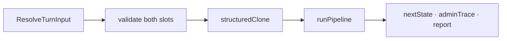

# Price War Engine — Architecture

> **Scope:** `@adamsaxion/pricewar-engine` only — the deterministic round simulator.  
> Behavior contract: [`PRICE_WAR_GAME_SPEC.md`](../../PRICE_WAR_GAME_SPEC.md).  
> **Execution runbook:** [`PRICE_WAR_ENGINE_EXECUTION.md`](../../PRICE_WAR_ENGINE_EXECUTION.md) — step-by-step wiring checklist.  
> Numbers/actions source of truth: `apps/econblog/price-war reference files/price_war_engine_spec (1).xlsx`.

The engine is a **pure TypeScript library**: no HTTP, no database, no React, no LLM. The host loads `MatchState`, calls `resolveTurn()`, persists the result.

---

## Public surface

### Core engine

| Export | Role |
|--------|------|
| `resolveTurn(input)` | One round of simulation |
| `validateMoves(state, slot, moves, scenario)` | Pre-submit + in-resolve validation |
| `advanceFromReportToDecide(state)` | Host calls when player leaves report → next decide |
| `createInitialMatchState(...)` | Factory from scenario config |
| `toPlayerView(state, slot)` | **Security-critical** redaction for one player |
| `replayMatchFromSubmissions(...)` | Full-match deterministic replay |

### Catalog & helpers

| Export | Role |
|--------|------|
| `COFFEE_SHOP_ACTIONS` / `ACTION_BY_ID` | 46-action metadata + UI input specs |
| `lockForecastForMoves(ids)` | Static Review & Lock bullets (IDs only) |
| `hasActionHandler(id)` | Whether behavior is implemented |

### Helpers (consumers of engine — may split to separate packages later)

| Export | Role |
|--------|------|
| `getBotPersona`, `getTutorialBotMoves` | Bot / tutorial move selection |
| `extractFacts`, `renderTemplateCoach` | Post-match coach (no LLM in engine) |

---

## Data flow (one round)

```
resolveTurn(input)
  │
  ├─ validateMoves(A) + validateMoves(B)     ← engine never trusts host
  ├─ structuredClone(input.state)            ← single copy
  ├─ createRng(matchId:round)
  ├─ createPipelineContext(...)
  │
  └─ runPipeline(ctx)                        ← 12 sequential steps
       │
       ├─ mutates ctx.state in place
       ├─ appends ctx.events[]  → returned as adminTrace
       └─ fills ctx.report
  │
  return { nextState, adminTrace, report }
```



**Host responsibilities after resolve:**

1. Persist `nextState` + `report`
2. Store `adminTrace` for admin/replay only — **never send raw events to clients**
3. Show report UI while `phase === "report"`
4. On Continue → `advanceFromReportToDecide(state)` → persist → `phase === "decide"`

---

## Sequential vs parallel

**Inside the engine: 100% sequential.** One thread, fixed step order, no worker pools.

| Why sequential | |
|----------------|--|
| Determinism | Same seed + moves → identical output (replay, anti-cheat, golden tests) |
| Explainability | Event trace reads in pipeline order |
| Cost | Full pipeline ≪ 1 ms; parallelism buys nothing users feel |

**Across matches:** the host runs many `resolveTurn()` calls concurrently via Node's event loop. Each call is independent.

---

## Simultaneous resolution contract

Gameplay is **simultaneous**; implementation is **sequential**. A-before-B loop order must never create hidden priority.

Rules:

1. At the start of `stepActions`, snapshot `actionBaseline` (both players' public + private state).
2. Handlers **read cross-player state from `actionBaseline`**, not from live `ctx.state` after the opponent's handlers ran.
3. Handlers **must not mutate the opponent's state** in `stepActions`. Cross-player interactions (poach vs train, price-match) go in a **dedicated pipeline step** with explicit rules, or via pending effects merged in fixed order.
4. If a rule explicitly grants priority (e.g. "faster domain resolves first"), document it on the action row — never rely on iteration order.

Future upgrade path: handlers emit `PendingEffect[]`, applied in a fixed phase order (see alignment spec domain priority).

---

## Pipeline order

Fixed in `engine/pipeline/run.ts` — **do not reorder** without spec + golden test updates.

```
 1. validate           Re-validate moves; emit round_started / move_submitted trace
 2. policies            Persistent policies (expand)
 3. events              Roll stochastic events → scratch.demandTotal
 4. actions             Handler registry; actionBaseline snapshot
 5. product             Product pass
 6. people              HR / training lag
 7. demand              Marketing modifiers
 8. allocate            Price + reputation + capacity split
 9. finance             Revenue, wages, COGS
10. reputation          Reviews (expand)
11. cleanupTransients   Clear overtimeThisRound etc. after finance consumed them
12. triggers            Bankruptcy, final round, phase → report | completed
13. reports             Public/private summaries + deltas
```

### Event timing vs mitigation

**Rule:** Only **persistent state from previous rounds** mitigates stochastic events this round.

- `stepEvents` **rolls** events and demand shift.
- Moves submitted **this round** affect **future** risk unless tagged `emergency` / `thisRoundMitigation` in the catalog.
- Example: inventory buffer bought in R3 protects from R4 onward; emergency restock can respond same round at a premium.

If mitigation must apply same round, add an explicit `applyEventImpactsWithMitigation` step after actions — do not silently fix in handlers.

---

## Round number semantics

| Field | Meaning |
|-------|---------|
| `market.currentRound` | Round **currently being decided** (during `decide`) |
| `market.lastResolvedRound` | Round whose report is shown (during `report`) |
| `report.round` | Same as `lastResolvedRound` |

After resolving round 2:

```txt
phase = report
currentRound = 2
lastResolvedRound = 2
```

After host calls `advanceFromReportToDecide`:

```txt
phase = decide
currentRound = 3
lastResolvedRound = 2   ← unchanged until next resolve
```

Do **not** increment `currentRound` inside `resolveTurn`. That caused "Round 2 report" UI bugs when `currentRound` already showed 3.

---

## PipelineContext

| Field | Purpose |
|-------|---------|
| `state` | Authoritative `MatchState` — mutated in place |
| `scenario` | Config including `allowStubbedMoves`, `maxActionsPerDomain` |
| `submittedA` / `submittedB` | Locked moves |
| `rng` | Seeded PRNG |
| `events` | Append-only trace → `adminTrace` |
| `report` | Finalized in `stepReports` |
| `scratch` | Round-local demand, allocation, weather — not persisted |

**Transient flags:** `overtimeThisRound` and similar `*ThisRound` fields must be cleared in `stepCleanupTransients` after finance reads them. Do not let one-round flags persist unintentionally.

---

## Stub handler safety

```ts
scenario.allowStubbedMoves === true   // dev, tutorial, UI integration
scenario.allowStubbedMoves === false  // ranked / production (default intent)
```

| Mode | Unimplemented handler |
|------|----------------------|
| `allowStubbedMoves: true` | `stubHandler` — trace event, no state change |
| `allowStubbedMoves: false` | `validateMoves` → `UNIMPLEMENTED_MOVE` |

**Current Coffee Shop config:** `allowStubbedMoves: true` until handlers ship. **Set `false` before ranked launch.**

---

## Event visibility

`adminTrace` is **admin / replay / coach fact extraction only**.

Player-facing outputs:

| Output | Audience |
|--------|----------|
| `toPlayerView(state, slot)` | One player — redacted |
| `report.publicSummary`, `report.publicEvents` | Both players |
| `report.privateSummary[slot]`, `report.deltas[slot]` | One player only |

The host must **never** push raw `adminTrace` over SSE or REST to clients.

Future: add `visibility: "admin" | "public" | "privateA" | "privateB"` on each `EngineEvent` when the trace grows.

---

## `toPlayerView` — security-critical

Single official redaction function. Required behavior (expand test suite as fields grow):

- Strip opponent: cash, debt, inventory, morale, staff, supplier tier, training, private policies
- Include opponent public: price, brand tier, display name, public actions
- Scout intel: only for scouting player, with staleness decay (when implemented)
- Inferable signals: foot traffic delta, review score — without revealing hidden cause

Tests: `test/visibility.test.ts`, `test/engine.test.ts` — add a case per sensitive field.

---

## Validation

### `validateMoves(state, slot, moves, scenario)`

- Max 3 moves per round
- Known move IDs
- `maxActionsPerDomain` (null = unrestricted — current product default)
- Cash checks for amount inputs
- `UNIMPLEMENTED_MOVE` when `!allowStubbedMoves && !hasActionHandler(id)`

### Conflicts (data-driven — TODO)

Import from `simulation/conflicts.ts`:

```ts
{ actionA, actionB, type: "hard" | "soft", reason }
```

Validator iterates the table; adding conflicts is a **data change**, not new if-statements. Populate from xlsx conflict sheet.

### Double validation

`resolveTurn` validates both slots **before** cloning. Host also validates on submit. Engine never trusts the host.

---

## Scenario config

Starting values come from **`simulation/config.ts`** (Sheet 4: $500 cash, 3 staff, $15 wage, 450¢ price, 100 foot traffic). Tech Startup = different scenario object, same factory.

```ts
type ScenarioConfig = {
  maxActionsPerDomain?: number | null;  // null = unrestricted
  allowStubbedMoves?: boolean;
  actionCatalogVersion?: string;
  version: string;                      // scenarioVersion on MatchState
};
```

---

## Versioning & replay

Every `MatchState` carries:

```ts
engineVersion
scenarioId + scenarioVersion
```

Add `actionCatalogVersion` on scenario when catalog rows change balance text or IDs.

Replay rule: same versions + same submissions + same seed → identical `adminTrace` and `nextState`. Mismatch across versions is expected after tuning — store version on `RoundReport` when reports become template-driven.

---

## MatchState serialization contract

`MatchState` lives in Postgres JSONB.

- Must be **JSON-serializable** — no `Date`, `Map`, `Set`, class instances, functions
- ISO strings for timestamps
- New fields need defaults in `createInitialMatchState`
- Future: `normalizeMatchState(raw)` for migrations and old replays

---

## State shape roadmap

v0 uses flat `playersPublic` / `playersPrivate` with optional runtime extensions.

**Target grouping** (incremental — do not block handler work):

```txt
playersPrivate[slot].finance.cash
playersPrivate[slot].people.morale
playersPrivate[slot].product.supplierTier
```

Flat bag with 40+ optional fields loses type safety; group by entity as handlers land.

---

## Report templates

`stepReports` delegates to `reports/build.ts`, which uses `reports/evaluate.ts` + `reports/templates.ts` (~30 rows: RPT-P01–P06 public, RPT-02–RPT-25 private).

```txt
evaluate conditions on post-resolution state (scratch + sim)
→ select templates (with follow-up chains)
→ interpolate ${cashDelta}, ${customers}, etc.
→ cap private narrative at 4 lines
```

Narrative stays out of handlers; coach LLM stays in host (async, post-match).

---

## Lock forecast

| Function | Input | Use |
|----------|-------|-----|
| `lockForecastForMoves(ids)` | Static IDs | Generic Review & Lock bullets from catalog |
| `reviewForecastForDraft(state, slot, moves, scenario)` | **TODO** | State-aware warnings (cash, opponent price, round number) |

Review screen needs both.

---

## Bot system (roadmap)

Bots are **engine consumers**, not part of `resolveTurn`.

Planned tiers mapped to Elo:

| Tier | Elo | Behavior |
|------|-----|----------|
| Beginner | 800–1000 | Hold price, hire when understaffed, occasional train |
| Intermediate | 1000–1200 | Reads opponent public signals |
| Advanced | 1200+ | Multi-round setups |
| Tutorial | — | Cooperative script, not competitive |

---

## Code patterns (summary)

| Pattern | Where |
|---------|--------|
| Pure function entry | `resolveTurn` |
| Pipeline steps | `engine/pipeline/steps/*` |
| Handler registry | `actions/handlers/registry.ts` |
| Catalog vs behavior | `catalog-data.ts` vs `handlers/` |
| Event trace | handlers → `adminTrace` |
| Transient cleanup | `stepCleanupTransients` |
| Deterministic RNG | `rng/seeded.ts` |

---

## Adding an action

1. Row in xlsx Actions Catalog  
2. Entry in `actions/catalog-data.ts`  
3. Handler in `actions/handlers/`  
4. Register in `registry.ts`  
5. Golden test: one round, assert state + events  
6. Visibility test if move adds new private fields  

| Kind | Effort |
|------|--------|
| Cash / stat delta | ~30 min |
| Demand / finance hook | ~2–4 hrs |
| Multi-round lag | ~1 day |
| Stochastic + hidden | ~1–2 days |

---

## Performance

Target: **fast enough for thousands of replays; never at the cost of determinism or explainability.**

- Regression gate: `test/pipeline.perf.test.ts` — 2000 resolves < 500 ms  
- 5 ms per round is still instant for async play  
- Do not skip pending effects, redaction tests, or normalization for micro-opts  

---

## Module layout

```
src/
├── index.ts
├── simulation/
│   ├── config.ts
│   └── conflicts.ts          # data-driven conflict table (populate from xlsx)
├── actions/
│   ├── catalog-data.ts
│   ├── catalog.ts
│   └── handlers/
├── engine/
│   ├── resolve-turn.ts
│   ├── advance-from-report.ts
│   ├── validate.ts
│   ├── errors.ts
│   └── pipeline/
│       ├── context.ts
│       ├── run.ts
│       └── steps/
├── scenarios/coffee-shop/
├── visibility/to-player-view.ts
├── rng/seeded.ts
├── bots/                     # consumer — may split later
├── coach/                    # template facts — LLM in host
├── replay/
└── tutorial/
```

---

## Review feedback — status

| Item | Status |
|------|--------|
| Pure engine boundary | ✅ Done |
| Sequential pipeline | ✅ Done |
| Simultaneous resolution / actionBaseline | ✅ Implemented |
| Stub safety (`allowStubbedMoves`) | ✅ Implemented |
| `adminTrace` naming | ✅ Done |
| Round number semantics | ✅ Implemented + `advanceFromReportToDecide` |
| Re-validate in `resolveTurn` | ✅ Done |
| Transient cleanup step | ✅ Done |
| `maxActionsPerDomain` config | ✅ Implemented |
| `toPlayerView` tests | ✅ Expanded (more as fields grow) |
| Conflicts table | ✅ Populated (12 rules; extend from xlsx) |
| Entity-grouped state | ✅ `simulation/player-sim.ts` fields on `playersPrivate` |
| Report template engine | ✅ `reports/templates.ts` + `reports/evaluate.ts` + `reports/build.ts` |
| `reviewForecastForDraft` | ✅ Implemented + exported |
| Bot difficulty tiers | ✅ Existing personas (tiers 1–5) |
| All 46 handlers | ✅ `all-handlers.ts` |
| `normalizeMatchState` | ✅ `state/normalize.ts` + host `loadMatch` |
| `allowStubbedMoves: false` | ✅ Production default on Coffee Shop |
| Event visibility per event | 📋 Roadmap |
| `normalizeMatchState` | 📋 Roadmap |

---

## Related docs

| Doc | Path |
|-----|------|
| Game behavior | `/PRICE_WAR_GAME_SPEC.md` |
| Host orchestration | `apps/econblog/src/server/pricewar/` |
